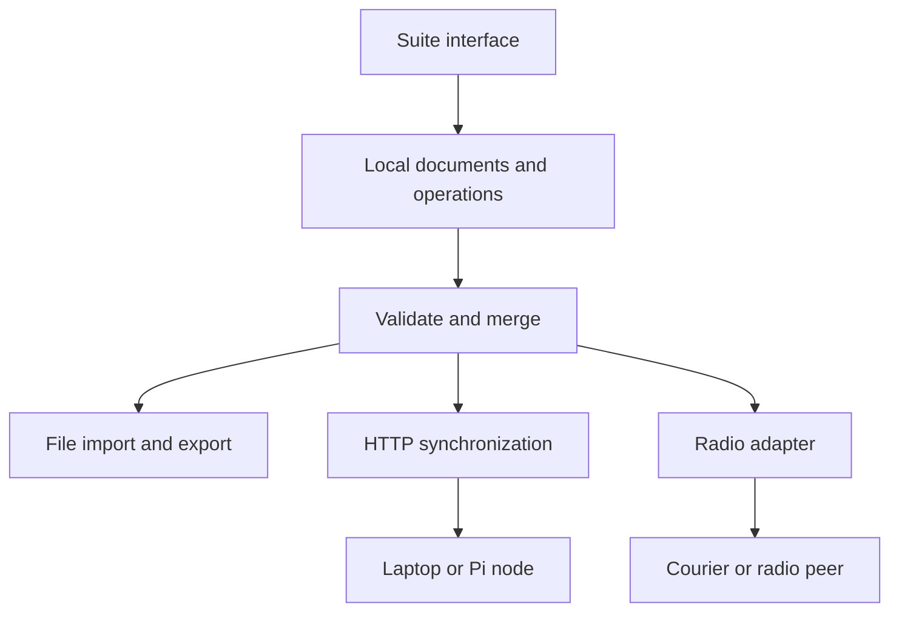

# The Local-First Library Suite: Comments, Wiki Posts, and a Later Reader

**Teaching and Gauntlet edition, revision 0.3 — 20 September 2026**  
**Whole-document comments first. Local-first storage and sync next. A wiki built from independent section posts after that. The C++ reader and passage-annotation application is a later subproject.**

This revision builds on the earlier reading-room guide, the project field guide, and our clarified product sequence. The original Markdown filename is retained so the document remains the same working reference. Version 0.3 changes the build order and application boundaries; it does not claim that these capabilities have already been implemented.

You implement the software yourself. This document supplies explanations, worked examples, contracts, research limits, and Gauntlet exercises rather than a finished application. Node.js and TypeScript remain the starting tools for the suite. C++ remains the intended later document-processing track and a natural option for embedded work.

Read the early chapters for the comment MVP, then follow the local-first chapters before beginning the wiki milestone. The detailed reader material is preserved in a clearly marked later track. The schedule and Gauntlet campaign below explain the exact dependency order, so a reader-format problem cannot block the earlier communications experiments.

## Contents

- [1. The larger suite — a library, conversations, and a collaborative guide](#1-the-larger-suite--a-library-conversations-and-a-collaborative-guide)
- [2. The agreed sequence — whole-item comments, local-first exchange, wiki posts, then annotations](#2-the-agreed-sequence--whole-item-comments-local-first-exchange-wiki-posts-then-annotations)
- [3. The parts — which machine does which job, and why](#3-the-parts--which-machine-does-which-job-and-why)
- [4. Session one — design three files and follow one browser request](#4-session-one--design-three-files-and-follow-one-browser-request)
- [5. What a comment belongs to — item IDs, file versions, and typed targets](#5-what-a-comment-belongs-to--item-ids-file-versions-and-typed-targets)
- [6. Session two — a tiny catalog and whole-item discussion](#6-session-two--a-tiny-catalog-and-whole-item-discussion)
- [7. Local-first foundation — understand the operation log before calling it a CRDT](#7-local-first-foundation--understand-the-operation-log-before-calling-it-a-crdt)
- [8. Edits, replies, deletion, and meaning — what the visible discussion derives](#8-edits-replies-deletion-and-meaning--what-the-visible-discussion-derives)
- [9. The browser becomes a replica — save locally before trying the network](#9-the-browser-becomes-a-replica--save-locally-before-trying-the-network)
- [10. Offline reopening — the service worker and the origin problem](#10-offline-reopening--the-service-worker-and-the-origin-problem)
- [11. Export and import — the first transport you can hold in your hand](#11-export-and-import--the-first-transport-you-can-hold-in-your-hand)
- [12. HTTP sync and two independent nodes — exchange what is missing](#12-http-sync-and-two-independent-nodes--exchange-what-is-missing)
- [13. The wiki milestone — pages, sections, and independent posts](#13-the-wiki-milestone--pages-sections-and-independent-posts)
- [14. Moving to a Pi — deployment without rewriting the application](#14-moving-to-a-pi--deployment-without-rewriting-the-application)
- [15. ESP32, SD cards, and firmware — shrink a proven responsibility](#15-esp32-sd-cards-and-firmware--shrink-a-proven-responsibility)
- [16. LoRa, Meshtastic, and Reticulum — choose a compatible route](#16-lora-meshtastic-and-reticulum--choose-a-compatible-route)
- [17. The controller idea — input, storage, and video are separate jobs](#17-the-controller-idea--input-storage-and-video-are-separate-jobs)
- [18. Moderation — community rules, local control, and an optional AI node](#18-moderation--community-rules-local-control-and-an-optional-ai-node)
- [19. Search and optional AI — derived work should not become a dependency](#19-search-and-optional-ai--derived-work-should-not-become-a-dependency)
- [20. More formats, Kiwix, and narration — adapters around the same notes](#20-more-formats-kiwix-and-narration--adapters-around-the-same-notes)
- [21. The spatial room — a useful interface over the same collection](#21-the-spatial-room--a-useful-interface-over-the-same-collection)
- [22. Trust and privacy — distinguish integrity, authorship, and permission](#22-trust-and-privacy--distinguish-integrity-authorship-and-permission)
- [23. The language boundary — TypeScript for the suite, C++ for the reader and embedded work](#23-the-language-boundary--typescript-for-the-suite-c-for-the-reader-and-embedded-work)
- [24. Reader subproject — file versions, renditions, and passage anchors](#24-reader-subproject--file-versions-renditions-and-passage-anchors)
- [25. Reader subproject — C++ EPUB ingestion and reproducible renditions](#25-reader-subproject--c-epub-ingestion-and-reproducible-renditions)
- [26. Reader subproject — selecting text and rebuilding a highlight](#26-reader-subproject--selecting-text-and-rebuilding-a-highlight)
- [27. Debugging by layer — find the smallest broken relationship](#27-debugging-by-layer--find-the-smallest-broken-relationship)
- [28. Research limits — enough understanding to make the next experiment](#28-research-limits--enough-understanding-to-make-the-next-experiment)
- [29. The revised work sessions — demonstrate comments, then local-first, then the wiki](#29-the-revised-work-sessions--demonstrate-comments-then-local-first-then-the-wiki)
- [30. Corrections to retain as the project evolves](#30-corrections-to-retain-as-the-project-evolves)
- [31. Reference shelf — what each source helps you answer](#31-reference-shelf--what-each-source-helps-you-answer)
- [32. Revision notebook — version 0.3 and what evidence comes next](#32-revision-notebook--version-03-and-what-evidence-comes-next)
- [33. The Reading Room Gauntlet — how to use these modules](#33-the-reading-room-gauntlet--how-to-use-these-modules)
- [RR01 — One Item Across the Room · Node.js, TypeScript, Express, HTTP forms, and file persistence · Small](#rr01--one-item-across-the-room--nodejs-typescript-express-http-forms-and-file-persistence--small)
- [RR02 — Keep the Conversation Attached · Catalog identity, file versions, and whole-item replies · Medium](#rr02--keep-the-conversation-attached--catalog-identity-file-versions-and-whole-item-replies--medium)
- [RR03 — Two Notebooks, One Combined History · Immutable operations and deterministic merge · Medium](#rr03--two-notebooks-one-combined-history--immutable-operations-and-deterministic-merge--medium)
- [RR05 — Leave the Room and Keep Writing · IndexedDB, transactions, offline reopening, and export · Large](#rr05--leave-the-room-and-keep-writing--indexeddb-transactions-offline-reopening-and-export--large)
- [RR06 — Retry Without Multiplying · HTTP synchronization, acknowledgments, and a Pi deployment · Large](#rr06--retry-without-multiplying--http-synchronization-acknowledgments-and-a-pi-deployment--large)
- [RR04 — Build the Guide from Posts · Wiki pages, sections, resource entries, and deterministic feeds · Large](#rr04--build-the-guide-from-posts--wiki-pages-sections-resource-entries-and-deterministic-feeds--large)
- [RR13 — A Post Arrives Before Its Page · Wiki dependency recovery and shared node transport · Medium](#rr13--a-post-arrives-before-its-page--wiki-dependency-recovery-and-shared-node-transport--medium)
- [RR07 — Carry One Note in Your Pocket · ESP32 firmware, serial framing, SD storage, and power loss · Large](#rr07--carry-one-note-in-your-pocket--esp32-firmware-serial-framing-sd-storage-and-power-loss--large)
- [RR08 — The Message Survives the Journey · LoRa transport, fragmentation, and measured range · Large](#rr08--the-message-survives-the-journey--lora-transport-fragmentation-and-measured-range--large)
- [RR09 — A Room You Can Walk Through · Spatial browsing, controller input, and shared content · Medium](#rr09--a-room-you-can-walk-through--spatial-browsing-controller-input-and-shared-content--medium)
- [RR10 — The Community Board Has Rules · Review queues, AI assistance, and scoped authority · Medium to Large](#rr10--the-community-board-has-rules--review-queues-ai-assistance-and-scoped-authority--medium-to-large)
- [RR11 — Give the Book an Address · C++ EPUB ingestion, hashes, renditions, and stable blocks · Medium](#rr11--give-the-book-an-address--c-epub-ingestion-hashes-renditions-and-stable-blocks--medium)
- [RR12 — Put the Highlight Back · DOM ranges, text coordinates, and anchor verification · Medium](#rr12--put-the-highlight-back--dom-ranges-text-coordinates-and-anchor-verification--medium)
- [34. Choosing the next hint — how to ask for help without giving away the implementation](#34-choosing-the-next-hint--how-to-ask-for-help-without-giving-away-the-implementation)

## 1. The larger suite — a library, conversations, and a collaborative guide

Start with a document and a place to talk about it. A person opens the catalog entry for an essay, photograph, recording, or PDF and adds a comment about the whole item. The comment does not yet identify a paragraph or a coordinate. It might say, “This interview belongs with the photographs from the neighborhood festival,” and point to another library item.

Next, make those conversations belong to the participants' devices. They can reopen downloaded discussion data while disconnected, add comments, and exchange missing contributions when a connection returns. A laptop, Pi, exported file, or eventually an ESP32 courier can help move those contributions. The transport should not decide what a comment means.

Then extend the same foundation into a wiki or subject guide. A page has sections, and each section contains separate posts or resource entries. Two people can add different entries while offline without competing to replace the same paragraph. On synchronization, both entries appear in a consistently ordered feed. This is the agreed first wiki model: a collaborative guide assembled from contributions, rather than a single shared text buffer.

The full reader and fine-grained annotation application comes later as its own project within this suite. It can add EPUB rendering, C++ document processing, stable passage selectors, highlights, and narration while reusing item identities, discussions, local storage, permissions, and synchronization. We are postponing that work, not pretending it has become unnecessary.

The suite may eventually be offered as a hosted service, but hosting is a deployment choice. A local-first client should still own the data it has downloaded and be able to save new contributions without asking a remote service first. Billing, public discovery, and multi-tenant administration are not first-session requirements.

### What local-first actually promises here

A supported client can reopen the app and its downloaded discussion or wiki data, commit new contributions locally, and try delivery afterward. Access to the underlying asset is a separate question: having comments about a video does not mean the video was downloaded. Make those two availability states visible. Local ownership and collaboration are broader goals than merely caching an HTTP page. [Ink & Switch: Local-first software](https://www.inkandswitch.com/essay/local-first/).

The first HTML-form prototype still saves on the server. It is a useful first step but not yet an offline browser replica. Keep that boundary explicit as you learn and build the layers yourself.

## 2. The agreed sequence — whole-item comments, local-first exchange, wiki posts, then annotations

The order below supersedes the earlier reader-first plan. It follows the actual near-term question: can people exchange lightweight contributions around shared materials, keep working while disconnected, and assemble a useful guide together?

| Stage | What you build yourself | What you can show | Work deliberately deferred |
|---|---|---|---|
| A: Whole-item comments | A catalog item, an open/download link, comments and replies, persistent records. | A comment survives a server restart and remains attached to the item. | Paragraph splitting, EPUB parsing, selection, and highlights. |
| B: Local-first behavior | Local transactions, offline reopening, duplicate-safe merge, export/import, and HTTP exchange. | Two disconnected clients contribute independently and later show both sets. | Radio range claims and collaborative text editing. |
| C: Wiki pages and section feeds | Pages, sections, independent posts/resource cards, references, and deterministic display order. | Two people add entries to a subject guide offline; both additions survive sync. | Simultaneous edits inside one prose buffer and drag-reordering a shared sequence. |
| D: Reader/annotation subproject | C++ document processing, renditions, passage selection, highlighting, and later narration. | A discussion can refer to verified words in a particular rendition. | Nothing here is required to complete A–C. |

Demonstration A is a whole-item discussion. Demonstration B is a close-and-reopen offline exchange. Demonstration C is an independently contributed wiki page. These names replace the old demo labels so later session planning uses one consistent sequence.

ESP32 and radio experiments branch from a working local-first exchange layer. Begin the wiki over files or LAN while the hardware branch progresses separately. There is no need to finish a long-range link before learning whether section posts make a useful guide. Conversely, a courier can carry comments before a wiki exists.

### Schedule by capability, not by an imagined finished platform

The first useful milestone is one asset entry and a discussion, even if opening the asset uses an existing viewer. The second is an offline discussion replica. The third is a small collaboratively assembled subject guide. Each has a visible stop condition and can be demonstrated independently. The reader has its own later milestones, so its format and anchoring problems cannot swallow the schedule for the larger suite.

## 3. The parts — which machine does which job, and why

A **client** is the interface someone uses. A **node** is a participant that stores or exchanges data. One machine can be both. A **relay** carries data onward. A **renderer** turns a document into something readable. These are responsibilities, not product categories.

| Part | Initial responsibility | Later responsibility | Why it belongs there |
|---|---|---|---|
| Laptop or desktop | Run the comments/wiki application; later invoke the reader processor. | Search, OCR, optional AI, serve other devices. | You already have a debugger, disk, and capable processor. |
| Phone browser | Open the first server-rendered reader. | Own local comments/wiki data and optionally downloaded assets. | People already carry it; its screen and browser are capable. |
| Raspberry Pi | Optional always-on host of the working application. | Archive, local services, radio bridge. | It can stay in a venue without occupying your laptop. |
| ESP32-class board | Later, move one bounded message through a queue. | Courier, radio interface, small file-serving appliance. | A narrowly defined task can fit a constrained device. |
| Display | Show the output of a computer or capable built-in platform. | Shared room, reader, or installation view. | A display by itself does not execute the reader. |

The Pi is optional. Your desktop can be the archive and radio-connected node. The phone is not “never the computer”: a modern phone does substantial computation, including rendering and local storage. However, a browser on a phone is not automatically a permanently available server for other devices.

An ESP32-S3 is also a computer, but with a very different environment. Firmware is the program installed on the board. ESP-IDF uses an embedded software stack; saying there is “no operating system” is misleading because FreeRTOS is involved. You do not get the normal Linux environment or desktop process isolation. The exact board, flash, RAM, USB wiring, and peripherals matter. [Espressif: ESP32-S3 getting started](https://docs.espressif.com/projects/esp-idf/en/stable/esp32s3/get-started/index.html).

### The architectural relationship



The reader should not need a special kind of annotation for each transport. A note received from an SD card should have the same meaning as that note received over Wi-Fi. Transport-specific envelopes can differ; the application object should remain recognizable.

## 4. Session one — design three files and follow one browser request

Your first implementation has three meaningful files: `item.json`, `app.ts`, and `data/operations.jsonl`. You write them yourself. The purpose of this section is to explain their responsibilities and the relationships you will implement, without giving you a completed application to copy.

`item.json` holds one catalog record: a stable item ID, title, description, and an optional reference to a file or external URL. `app.ts` owns the server routes and the small persistence functions. `operations.jsonl` holds saved operations, one JSON object per line. A separate template file can come next; you do not need a frontend build pipeline to learn this first connection.

### Step 1: Establish the smallest environment

Use **Node.js with TypeScript and Express** for the starter path. This choice uses the JavaScript you already know while giving the growing operation model explicit types. Node runs the server process; Express maps HTTP requests to handlers; TypeScript checks relationships in your code. None of those choices changes the contribution protocol, and a frontend framework is not needed for the first HTML form.

Create a project directory, initialize its `package.json` with `npm init -y`, install Express, and add TypeScript plus the Node and Express type declarations as development dependencies. The package names are `express`, `typescript`, `@types/node`, and `@types/express`. Keep the generated lockfile so you can reproduce the dependency versions. `package.json`, `package-lock.json`, and `tsconfig.json` are supporting configuration files; the three files above remain the conceptual core, not a claim that the entire directory contains only three files.

For this guide's execution path, use a supported Node release at least version 22.18 and ordinary erasable TypeScript syntax. Set `"type": "module"` in `package.json`, follow Node's documented TypeScript compiler settings, enable strict checking, and keep `noEmit` enabled for the type-check step. Execute your own server with `node app.ts`; run `npx tsc --noEmit` separately to check types. Node's native execution removes supported type syntax but does not type-check or use `tsconfig.json` to transform your code. Avoid enums, runtime namespaces, and path aliases in this first exercise. [Node: Running TypeScript natively](https://nodejs.org/en/learn/typescript/run-natively), [Node: TypeScript module support](https://nodejs.org/api/typescript.html).

Verify that your own small `.ts` file runs and that your type-check command reports an intentional type error before adding HTTP behavior. These prove two different capabilities. Read Express's small request/response example for the route concept, then write your own handler. [Express: Hello world](https://expressjs.com/en/starter/hello-world.html).

Types help you avoid accidentally omitting an operation field or passing the wrong object between functions. They do not validate a form submission or imported JSON. Treat external values as untrusted, validate their structure and limits at runtime, and only then treat them as your application type. Writing `as CommentOperation` is an assertion, not a validation step. [TypeScript: Everyday Types](https://www.typescriptlang.org/docs/handbook/2/everyday-types.html).

For the first item, choose a small essay or image you already have and assign its catalog record a generated stable ID. Write a route that displays its title, description, and an open/download link. The linked file can open in an existing viewer; you are not building that viewer yet. At this moment, there is no comment behavior. The first success is a request reaching your code and returning the intended item record.

### Step 2: Trace a request before introducing persistence

Open `http://127.0.0.1:5000` if you chose port 5000. In the browser's network panel, find the request. In your terminal, find the corresponding server log. Explain the relationship in a sentence: the browser asks for a path, Express chooses a handler, the handler returns a response, and the browser renders it.

A route is a mapping from an HTTP method and path to behavior. The path is not necessarily a file on disk. A handler may read a file, query a database, or construct HTML; the browser only sees the response.

### Step 3: Specify the storage functions you will write

Give yourself three interfaces: `readOps()` returns the saved operation objects; `appendOp(op)` records one accepted operation; `opsForItem(itemId)` selects the notes belonging to one catalog item. Write a one-sentence contract for each before implementing it. With asynchronous filesystem operations, the contracts return promises: for example, reading returns `Promise<CommentOperation[]>`, while appending can return `Promise<void>` and reject on failure. You define `CommentOperation` yourself from the fields this exercise needs; the later sections refine it.

Use `node:fs/promises` for the asynchronous file boundary and await completion before reporting success. A single JavaScript event loop does not serialize all asynchronous disk writes for you. Give the first log one coordinated writer, and distinguish successful completion from guarantees about surviving sudden power loss. [Node: File system](https://nodejs.org/api/fs.html).

For example, the append contract should say what happens when the destination directory is missing or a write fails. Does the function report failure? Does its caller still redirect to a success page? These questions matter more than whether the function occupies five lines or twenty.

A record contains a unique operation ID, an item target, a comment body, and a human-readable creation time. An optional parent comment ID makes it a reply. The target is the whole catalog item, so there is no resource path, paragraph ID, selection range, or rendition requirement. Section 5 distinguishes an item from a particular file version.

### Step 4: Follow one note from the form to the disk

Add a labeled text area and Save button to the page. The form submits a POST to a route you choose, such as `/comments`. Ordinary HTML forms submit URL-encoded fields by default, so configure Express's URL-encoded body parser with an explicit size limit before the route. JSON parsing middleware alone does not decode that form format. The handler validates the resulting values, creates the operation, awaits your storage function, and returns a redirect to the reader. [Express API reference](https://expressjs.com/en/api.html). The reader then rebuilds the visible list from saved records.

This is the sequence to implement in your own code:

```text
Receive the submitted form.
Reject a missing or excessively long note.
Create one immutable operation with a fresh identity.
Persist it, and surface a failure if persistence fails.
Redirect to the ordinary reader page.
Read saved operations and render the relevant notes.
```

A redirect after a successful POST lets the browser return to a normal GET page, so refreshing that page does not ordinarily repeat the form submission. It does not solve all duplicate delivery; section 9 explains why later retries need the same operation ID.

Render note bodies as escaped text. A reader's note should not become executable HTML simply because it contains angle brackets. Keep the first server to one process and understand its write coordination. A plain append file is deliberately transparent, but it does not automatically provide transactional recovery from a partial write.

### Step 5: Prove that the note is on disk

Save a note, stop the process completely, and open the log in a text editor. You should be able to identify the exact record without running the application. Restart the process and reload the page. If the note returns, you have evidence of persistence across process death.

If it does not return, resist rewriting the whole app. Find which relationship failed: perhaps the POST never arrived, the handler wrote a different path, the record failed to parse, or the reader filtered against a different item ID. Each possibility has a smaller experiment.

### Step 6: Cross the first physical boundary

Open the page from your phone on the same reachable LAN. Use the laptop's actual local IP, such as `http://192.168.1.23:5000`, rather than typing that example blindly. Configure the server to listen on the relevant network interface.

`127.0.0.1` means the device making the request. On the phone it points at the phone, not the laptop. `0.0.0.0` is a server bind choice, not the destination address you type into the browser. If the laptop works but the phone does not, inspect the address, firewall, network membership, and guest-network isolation before changing application code.

Keep development experiments on a trusted test network. Bind the HTTP listener deliberately, and keep any Node inspector/debug port private. When you reach deployment, add intentional error handling, process startup, shutdown, and persistence configuration; a process that responds on your laptop is not yet a maintained venue service.

**Stop here when:** a note submitted from your phone survives a complete server restart. You have built Demonstration A yourself. The phone is still relying on the laptop for saving; its own offline replica comes later.

## 5. What a comment belongs to — item IDs, file versions, and typed targets

The first identity problem is simple: which thing is this conversation about? A filename is a poor answer because people rename files. A title is a poor answer because two entries can share a title. A file hash identifies exact bytes, but a catalog item can outlive one particular set of bytes.

Give the catalog item a stable generated ID. Give each file version a full content hash when you have its bytes. Keep those responsibilities separate. The item “Interview with Ms. Jones” might first reference a compressed listening copy and later gain a higher-quality transfer. The conversation should remain attached to the item unless a contribution deliberately names a particular file version.

| Identity | What stays recognizable | Example |
|---|---|---|
| Collection ID | The sharing scope and catalog grouping. | Neighborhood archive workshop. |
| Item ID | The continuing library entry. | Interview with Ms. Jones. |
| File hash | One exact immutable byte sequence. | A particular WAV file or PDF export. |
| Comment ID | One contribution or reply. | A question about the interview. |
| Page and section IDs | The continuing wiki containers. | Oral-history guide / Interviews section. |
| Post ID | One independent section contribution. | A resource card recommending that interview. |

These are proposed project identities, not a demand to build all six kinds tonight. Start with item and comment IDs, but avoid naming a generic target field `paragraphId` or assuming that every object is a document rendition.

### A worked example: improving a scan without losing its discussion

You create item `item:festival-poster`, initially pointing to file hash A. A participant comments that the date is hard to read. Later you attach a better scan with hash B. Both hashes remain distinct; the item remains the same. The existing comment continues to appear under the item, and a reply can say that a clearer scan is now available. If a comment is specifically about defects in scan A, it can include an optional version reference to A.

Creating new files with different bytes must not silently rewrite the identity of the old file. Changing the item's list of available versions is a catalog action, not modification of those old bytes. Conversely, importing the same bytes twice does not necessarily mean two independently curated item records should be collapsed. Detect duplicate file content while retaining catalog intent.

### A small whole-item comment, explained

```json
{
  "schema_version": 1,
  "op_id": "op:illustrative-unique-id",
  "kind": "comment.create",
  "collection_id": "collection:workshop",
  "target": {"type": "item", "id": "item:festival-poster"},
  "body": "Does anyone know who designed this poster?",
  "reply_to": null
}
```

These IDs are explanatory placeholders, not an allocation scheme. Your implementation generates collision-resistant IDs and validates fields. The operation says who or what it concerns and what was contributed. It does not claim to locate words inside the poster. Author identity and ordering metadata are added under the rules in section 7; they are omitted here to keep the target relationship clear.

A reply is a new contribution naming the original comment. Its target remains the same item. Validate that the referenced parent belongs to the intended discussion rather than accepting a cross-collection link as permission to reveal another conversation.

### A URL is a location, not an immutable identity

An external link can be part of an item record even before you download the asset. Keep the item's own ID stable, store the URL as a locator, and do not invent a file hash for bytes you have not obtained. A link can stop working or point to changed content while the catalog discussion remains meaningful. Show that the asset is unavailable without hiding locally saved comments.

**Stop here when:** renaming an item and attaching another file version do not detach its comments, and two different items with the same title retain distinct discussions.

## 6. Session two — a tiny catalog and whole-item discussion

Your next step is a catalog, not an EPUB importer. Use two or three curated items of different kinds: an essay, an image, and a linked resource. The application only needs enough metadata to show what each is and a way to open or download it. It does not need to render every format internally.

### Follow a comment through the catalog

Open item A and post a question. Open item B and verify that the question is absent. Return to A and add a reply. Restart the server and confirm that the question and reply remain attached to A. Then change A's display title. If the discussion disappears, your implementation probably used a display string as identity.

The record on disk should name the target explicitly. Avoid relying on the current route, selected tab, or a server variable remembering which item was most recently opened. Those are temporary interface states. The record must still explain its target after a restart or after being exported to another node.

### Keep attachments and conversations independent

A comment may mention an asset whose bytes are not present on this device. Display the title and the locally available discussion, alongside an honest message that the asset has not been downloaded. This is an important rehearsal for radio: carrying a few comments must not require carrying the underlying video or book.

For a first locally hosted file, serve only files within the intended asset store. A client-supplied path is not permission to read arbitrary files on your computer. Keep registration of new assets a deliberate action rather than introducing unrestricted uploads in the first discussion form.

### The smallest catalog contract

Your catalog record needs a stable item ID, a collection reference, title, optional description, and zero or more file-version or external-link references. Your comment query needs the target item and collection. File metadata can include hash, byte size, and media type once known. You can start with a hand-authored catalog file rather than building catalog editing and ingestion together.

Initially, choose one curator to edit catalog metadata. Independent comments can already be multi-author. Shared renaming and rearrangement introduce their own policies; they do not have to be solved to prove the first discussion.

**Stop here when:** comments and replies survive restarts, remain isolated by item, and remain readable when an asset is missing. Then continue to local-first storage and exchange. There is no paragraph indexing checkpoint in this milestone.

## 7. Local-first foundation — understand the operation log before calling it a CRDT

A log is a storage format. A CRDT is a data structure with particular merge behavior. Simply writing JSON to a file does not create those properties. The useful first model here is a grow-only set of immutable operations. The set grows when a previously unseen operation is accepted.

CRDTs support replicas that update independently and later reconcile. Their guarantees depend on the chosen data type and its rules. A convergent result is not automatically a result that matches every user's intention. [CRDT research overview](https://crdt.tech/).

### Follow three notes through a merge

Alice has operations `a1` and `a2`. Bob has `a1` and `b1`. The shared `a1` is the same object, copied from an earlier exchange. The union contains `a1`, `a2`, and `b1` exactly once each.

If Bob sends `b1` five times, the answer remains three objects. If Alice's packet arrives after Bob's, the answer remains three objects. If you exchange the files twice, nothing new appears the second time.

| Term | Plain meaning | What to test |
|---|---|---|
| Idempotence | Repeating the same merge has no additional effect. | Merge A with A. |
| Commutativity | Swapping the inputs does not change the answer. | Compare merge(A, B) with merge(B, A). |
| Associativity | Grouping exchanges differently does not change the answer. | Compare (A with B) with C against A with (B with C). |

These are useful because delivery order, retries, and intermediate relays should not alter the set of accepted contributions.

### The hidden bug in a familiar dictionary loop

The earlier guide used `merged[op_id] = op`. That works only when an ID always means exactly one immutable payload. If two different payloads claim the same ID, whichever arrives last overwrites the other. Swapping inputs changes the result.

For a trusted teaching dataset, reject the conflict explicitly. Implement the following behavior yourself: visit each operation in both inputs, validate its identifier, and check whether you already hold that identifier. If it is new, retain the object. If the retained payload is equal, treat it as a duplicate. If the retained payload differs, report an identity conflict instead of overwriting either silently. Finally, produce a deterministic order for comparison.

Use a three-record example on paper first. Let A contain `{id: a1, body: hello}` and B contain `{id: a1, body: changed}`. Ask what your current loop would return for A+B and B+A. If the answers differ, you have located the failure without needing a network or a CRDT library.

Sorting IDs provides deterministic output for comparison. It does not establish meaningful chronology. Define payload equality explicitly. JavaScript object equality with `===` checks identity rather than structural equality, and plain `JSON.stringify` is not a complete canonicalization or signing specification. Define how validated operation payloads are compared, including field ordering and permitted value types.

Rejecting an entire conflict-containing batch also is not a complete hostile-network convergence policy. Later, quarantine conflicting variants under their payload hashes and define the same conflict behavior on every node. Never silently overwrite a previously accepted object.

### IDs, devices, and counters

A display name is not an identity allocator. Two people can both be “Alex.” One person can have several devices. Reinstalling an app can reset a counter. Therefore `(name, counter)` is not a safe general operation ID.

For the first experiment, use random UUIDs for operations. For a later actor-and-sequence design, generate a random actor ID for each installation and atomically allocate its sequence alongside saving the operation. A restored copy of a device database should get a fresh actor identity before it starts writing, or it can reuse the original device's sequence space.

A Lamport clock tracks logical order: before creating a local event, advance the local counter; after receiving another counter, advance beyond the maximum of the two. It helps order events consistently with observed dependencies. It does not prove that one author is a real person, does not establish wall-clock time, and does not tell you that an event with a larger value caused another event. Identity, chronology, and authentication are different jobs.

**Stop here when:** the three merge properties pass for valid fixtures, duplicates are harmless, and a same-ID/different-payload fixture raises a visible error. You have proved the file-merge component of Demonstration B; browser-owned writes and offline reopening are still separate gates.

## 8. Edits, replies, deletion, and meaning — what the visible discussion derives

An immutable operation set can still support an interface where notes appear edited or hidden. The trick is to add a new event describing the change and derive the visible state from the accumulated events.

For the first discussion and wiki feeds, prefer follow-up posts or explicit correction posts instead of editing shared text in place. The following revision example is a later capability, not an MVP requirement.

Suppose `n1` creates “This was written in 1930.” A later operation `r1` revises that note to “This edition was published in 1930.” The original remains in history; the UI can show the revision. A reply `q1` refers to `n1`. A hide event `h1` expresses a visibility decision under a particular policy.

### Later edits to an existing contribution need a deliberate rule

Your phone and laptop both have `n1`. Offline, the phone creates revision `r1`; the laptop creates revision `r2`, each based on `n1`. Neither has seen the other. There is no single obvious “latest intended text.”

For the first implementation, show both concurrent revisions and let the author choose. A resolution event can name both revision IDs and contain the chosen wording. That preserves work and makes the conflict intelligible. Later you can adopt a richer text CRDT if simultaneous collaborative writing becomes a real requirement.

Store explicit dependency references such as `revises: ["n1"]` and `resolves: ["r1", "r2"]` if the view needs to reason about these relationships. A Lamport number by itself is not a complete record of concurrency.

### Hiding is not erasing every copy

A tombstone can tell cooperating clients not to display a note. It does not remove exported copies, screenshots, or data held by an offline peer. Your own node can delete local payload bytes under a retention policy, but that is separate from globally recalling the content.

Do not call the whole design an observed-remove set unless you implement that data type's actual remove semantics. A grow-only event set with an application-specific view is a clearer description of this first design.

### Later reader state: reading position deserves a different rule

Imagine reading chapter 8, then opening chapter 2 to revisit a passage. “Keep the furthest chapter” would discard the intentional return. Store positions per device initially, or offer a choice between recent positions. Every kind of state does not need the same merge policy simply because it lives in the same application.

## 9. The browser becomes a replica — save locally before trying the network

So far the server owns the notes. Now the browser must own a database. IndexedDB provides transactional storage of structured objects and indexes in the browser, with asynchronous operations. Its storage is associated with an origin. [MDN: IndexedDB API](https://developer.mozilla.org/en-US/docs/Web/API/IndexedDB_API).

For our proposed design, give the browser stores for operations, pending deliveries, identity state, item metadata, peer checkpoints, and later reading positions. The important detail is the transaction boundary: recording a new operation and its pending-delivery entry should succeed or fail together.

### What “saved” should mean

The user presses Save. The browser allocates the operation ID, begins a local transaction, writes the operation and pending entry, and waits for transaction completion. Only then should the UI say “Saved on this device.” Synchronization is a later action and can have a separate status.

If local storage fails because the device is full or permission is unavailable, keep the draft visible and report the failure. Do not show success simply because an in-memory object exists. Conversely, a network failure after a successful local transaction should leave the saved note intact.

### Worked failure: the acknowledgment disappears

The phone creates `p1` and commits it locally. It sends `p1` to the Pi. The Pi commits `p1`, but the connection breaks before the reply arrives. The phone cannot tell whether the Pi received it.

On the next attempt, the phone resends the same `p1`. The Pi sees the same immutable object and acknowledges it without making a second note. The phone can now clear that peer's pending-delivery marker. It does not delete the note itself.

This is why retry safety belongs in the object model. You cannot repair a lost acknowledgment by assuming a network request executes exactly once.

### Browser storage is useful, but it is not a backup

Browser storage can be cleared by the user, constrained by quotas, or evicted under platform policies. Persistent-storage requests can help where supported, but a web application should not promise unlimited or permanent retention. The earlier blanket “Safari always deletes it in seven days” claim is too broad to use as the system's specification. [MDN: Storage quotas and eviction](https://developer.mozilla.org/en-US/docs/Web/API/Storage_API/Storage_quotas_and_eviction_criteria).

Make export available on every platform. An Android browser is not exempt from the need for a user-controlled backup. Test on your actual iPhone/browser combination instead of using a platform stereotype as proof.

## 10. Offline reopening — the service worker and the origin problem

A database full of notes is not enough if the application cannot reopen without the server. The discussion app also needs its HTML, JavaScript, CSS, downloaded catalog records, and saved conversations. Downloading the underlying document or media file is a separate optional action. A service worker can intercept requests and provide cached responses; it requires an appropriate secure context, with localhost treated specially for development. [MDN: Service Worker API](https://developer.mozilla.org/en-US/docs/Web/API/Service_Worker_API).

Think of IndexedDB as the notebook cabinet and the application cache as the building containing the desk and lights. Saving the notebook does not automatically save the building. Both need an offline plan.

### Separate conversation readiness from asset readiness

For the first milestone, “Save discussion offline” means the application shell, selected item metadata, and the chosen conversation snapshot are available. New comments can then be saved locally. It does not mean you possess every future comment; later exchanges bring new contributions.

“Download asset” is a separate action with its own byte count, completeness checks, and failure state. A missing PDF must not prevent you from reopening a cached discussion about it. In the later reader subproject, downloading a complete EPUB rendition adds the chapter-resource verification described there.

Use explicit cache versions and a controlled update flow. A new service worker should not discard resources still required by an open client. Start with a visible reload action rather than making silent updating part of the first reliability claim.

### Why a page working over local HTTP is not the complete phone test

`http://localhost` on the development computer and `http://192.168.1.23` on a phone do not have the same security status. For a phone accessing a LAN server, plan a trusted HTTPS setup before promising service-worker installation and offline reopening. A certificate warning bypass is not a reliable substitute for a trusted deployment.

A practical development route is to prove offline reopening on laptop localhost, then test a real HTTPS deployment on the target phone. A public HTTPS application may still encounter restrictions when contacting a local HTTP node; mixed-content, CORS, and local-network policies are additional integration questions. File export/import remains a useful bridge while you resolve them.

Origin stability matters too. Changing scheme, hostname, or port can give the browser a different storage context. Moving from a numeric IP to a hostname does not automatically move the user's local database. Export and import before changing the entry point, or build an explicit migration.

### Demonstration B, honestly performed

Open the actual browser rather than relying on a captive-portal popup. Save an item record and its discussion, close the tab, disable the network, reopen the application, read its existing comments, and write another comment. Leave the underlying asset undownloaded in one test so you prove these capabilities are independent. Close and reopen once more. Reconnect and synchronize, then verify that a second client receives the note exactly once.

If only the original open tab works offline, the demonstration is incomplete. You have proved an in-memory session, not reliable reopening.

## 11. Export and import — the first transport you can hold in your hand

Include selected catalog records and, once the wiki exists, the page and section definitions needed to interpret the exported posts. Missing ancestry should be reported, not silently replaced by a newly invented container.

An export is more than a backup button. It is a synchronization transport that does not care whether two devices are simultaneously reachable.

Define a proposed `.rrpack` as a ZIP containing a versioned manifest, an operation file, optional reading state, and optional document or attachment blobs. Include original documents only when explicitly selected; a notes-only package can be much smaller.

| Package item | Purpose |
|---|---|
| `manifest.json` | Format version, included objects, sizes, hashes, and creation metadata. |
| `ops.jsonl` | Immutable comments, replies, and later page, section, and post operations. |
| `reading-state.json` | Optional personal state with its own merge rules. |
| `blobs/` | Optional files indexed by their full content hashes. |
| `README.txt` | A plain explanation of how to inspect the package without the app. |

Import should stage the data, validate sizes and structure, verify blob hashes, and merge accepted operations. It should never begin by erasing the user's existing database. Unknown schema versions should produce a useful message; do not silently interpret unfamiliar fields as if they were understood.

### Worked exchange

Your laptop has notes A and B. Your phone has A and C. Export the laptop package and import it on the phone. The phone should now contain A, B, and C. Import the same package again. It should still contain three notes. Export the phone and import it on the laptop. Both now contain the same three.

If a referenced attachment is absent, keep the note and show that the attachment is unavailable. Metadata arrival does not imply payload arrival. That distinction becomes especially useful over radio.

**Stop here when:** two devices can exchange files in both directions without overwriting independent notes, and a deliberately altered blob is rejected by hash verification.

## 12. HTTP sync and two independent nodes — exchange what is missing

Once file exchange works, HTTP is another delivery method. Begin with an explicit Sync button and foreground requests. A failed request should leave pending work available for another attempt. Background execution is an enhancement, not the basis of correctness.

A useful proposed API separates discovery, transfer, and acknowledgment:

| Endpoint | Purpose | Important rule |
|---|---|---|
| `GET /library` | List catalog items; add wiki listings later. | A listing is not proof that a document is downloaded. |
| `GET /items/<id>` | Retrieve catalog metadata and known file references. | The item remains distinct from any individual file version. |
| `POST /ops` | Submit a bounded batch of operations. | Validate, deduplicate, commit, then acknowledge accepted IDs. |
| `GET /sync/ids` | List accepted operation IDs in a selected collection. | Paginate and define the collection scope. |
| `POST /sync/want` | Request particular missing objects. | Limit the request and response sizes. |

This is a project API proposal, not a universal standard. Start with readable JSON. Optimize encoding only after you can measure its cost.

### Worked reconciliation

Node A has IDs `{1, 2, 5}`. Node B has `{1, 3, 5}`. A asks for `3`; B asks for `2`. After validation and transfer, both have `{1, 2, 3, 5}`. Exchanging a sorted list of IDs is inefficient at large scale, but it is understandable and sufficient for a small first collection.

The ID list also needs a defined snapshot or repeatable pagination strategy. If data changes during a long exchange, run another reconciliation pass afterward. Do not infer permanent agreement from one incomplete page of results.

### Why “I have everything through 5” can be false

A receiver might have actor A's operations 1, 2, and 5 because packets 3 and 4 were delayed. Reporting only the maximum sequence number hides those holes. If you introduce per-actor summaries, report a contiguous prefix plus gaps or use another protocol that represents missing ranges correctly.

A byte cursor has a different limitation. Byte 10,000 in node A's log has no relationship to byte 10,000 in node B's log. Their arrival orders can differ. A server-local cursor should be tied to a server identity and log generation, checked at record boundaries, and invalidated when the log is rebuilt. Set reconciliation remains the portable fallback.

### Polling versus WebSockets

Polling is a good first choice because each exchange is explicit and easy to retry. Twenty clients polling every two seconds create roughly ten requests per second before retries and other traffic. Whether that is cheap depends on response size, parsing, storage access, connection behavior, and hardware.

WebSockets are not inherently incompatible with twenty people. The earlier categorical claim confused a constrained server configuration with all servers. A laptop or Pi can be evaluated differently from an ESP32. Measure the actual implementation rather than treating a remembered socket limit as a physical law.

**Stop here when:** you can interrupt a transfer after the receiver commits but before the sender gets an acknowledgment, retry it, and still obtain one copy of each operation.

## 13. The wiki milestone — pages, sections, and independent posts

**Build this after the local-first discussion passes offline reopening, file exchange, and HTTP retry tests in sections 9–12.** The chapters explain the machinery before you extend it to another application. This wiki is a collection of pages whose sections hold independently authored posts. It does not start as a jointly edited prose document.

Think of a subject guide called “Neighborhood Film and Oral History.” It has sections called “Start Here,” “Interviews,” and “Further Reading.” In “Interviews,” one person adds a resource card linking an audio item, and another adds a contextual note. Each contribution has its own identity. Synchronization preserves both; it does not have to weave their words into one paragraph.

### The container relationships

| Object | Meaning | Example contribution |
|---|---|---|
| Page | A stable guide or subject space with a title. | Neighborhood Film and Oral History. |
| Section | A stable grouping within that page. | Interviews. |
| Post | An independent authored entry within one section. | Why this recording matters, with an item reference. |
| Reply | A contribution referring to an existing post. | A clarification about the interview date. |
| Resource reference | A link to a catalog item, optional file version, or external URL. | The existing interview item, not a second copy of its audio. |

A post can contain plain text and a small list of resource references. Add richer Markdown only when rendering and sanitization behavior are defined. The section itself need not be a shared rich-text field. If it needs introductory prose, the curator can create an introductory post. This keeps the first model internally consistent.

### “Sequentially” means a shared display rule, not arrival order

Suppose Alice and Bob both have two posts in the Interviews section. They disconnect. Alice adds A3 while Bob adds B3. There was no central observer assigning a definitive third place. If each device simply appends incoming posts to its current list, Alice may see A3 then B3 while Bob sees B3 then A3.

The solution is to keep membership and display order separate. Membership is the set of accepted posts. Display order is a deterministic rule over the same saved metadata. A proposed first rule is ascending `(lamport, actor_id, seq, op_id)`, with restricted ASCII identifiers compared by the same lexical rule on every implementation. The logical counter is immutable once attached to a saved operation; receiving it must not rewrite that operation's counter.

Lamport values preserve ordering implied by observed events when maintained correctly, but they do not establish precise real-world chronology. Human timestamps can be displayed as approximate context without deciding the merge. A post created during an earlier disconnected session can appear above posts you have already seen when it finally arrives. The interface can mark it as newly received without claiming it was newly authored.

### A worked ordering example

Both devices have observed logical counter 12. Alice creates `(13, actor-a, 4, op-A)` and Bob creates `(13, actor-b, 7, op-B)`. Because the actor IDs break the tie consistently, both devices show A before B once they possess both. If Bob then reads A and replies, the reply gets a later logical counter and explicitly names A as its parent. The parent reference expresses the relationship; the number alone does not.

This is sufficient for an append-oriented feed. It is not a general solution for collaborative drag-reordering. A later editorial order can be a separate curator-controlled view; do not allow casual rearrangement to quietly turn the simple feed into a shared sequence-editing project.

### Creating pages and sections while disconnected

Page creation and section creation also need unique IDs. A `page.create` operation introduces a page, a `section.create` operation names its parent page, and `post.create` names its parent section. The section and page creation events must eventually travel with the posts or be retrievable separately.

Two people can create pages with the same title. Retain them as distinct pages initially and offer a later curator decision about linking or consolidating them. A title collision is not proof that their contents should be automatically combined. For an initial workshop, distribute the common page and section definitions first so contributors usually append into known containers.

A post might arrive before its section. Preserve a valid authorized post as pending on a missing parent, request the missing object, and show that relationship as unresolved. Do not drop it or attach it to whichever section happens to be open. Limit unresolved-object storage so missing references cannot grow without bound.

### Follow-ups and corrections instead of competing text edits

If Alice wants to correct her post, the first version can add a new post that references the original with a correction relationship. The original stays in history; the view can display the correction beside it. If another person disagrees, they reply or add a separate contribution. There is no automatic rewriting of Alice's original prose.

If you later enable mutable titles, section order, or post revision, each requires its own authorization and conflict rule. Keeping the first edition append-oriented avoids these requirements for now; it does not eliminate them from every possible wiki design. Deleting or hiding a post is likewise a separate policy event, not erasure from everyone's copy.

### The same delivery foundation, different application validation

Comments and wiki posts can share operation identities, pending queues, acknowledgments, export packages, and transport adapters. They have different target types and validation rules. A comment targets an item; a post targets a section; a section targets a page. The same envelope does not mean accepting any target combination.

A file package or node can carry page definitions and small text posts before the linked assets arrive. The user can read the guide and its discussions even if a large recording is still waiting for Wi-Fi. An ESP32 courier can carry these bounded objects without rendering the wiki or merging text.

**Stop here when:** two devices create different posts in the same section while disconnected, exchange them in different orders and with duplicates, and show the same accepted membership and ordering. Include a reply arriving before its parent and a post arriving before its section. Both should resolve when the missing definitions arrive.

## 14. Moving to a Pi — deployment without rewriting the application

A Pi is useful when you want the room to remain available after your laptop leaves. It is not required to make the design local-first. Move the working application onto it with the same data format and the same tests.

Before a public demonstration, configure the teaching Node/Express process for an appropriate production deployment. Add a persistent data directory, service startup, logs, a backup/export procedure, and a deliberate network entry point. Decide whether the device joins an existing network or sits behind a small router you control. A Wi-Fi access point, an HTTP server, and an offline-capable browser application are three separate pieces.

### When SQLite becomes worthwhile

JSONL is excellent for seeing the objects. It becomes awkward when you need concurrent requests, unique constraints, reliable transactions, and indexed queries. SQLite can enforce uniqueness for `op_id` while atomically committing accepted operations and related state. Its transaction machinery addresses failure recovery that a hand-written append loop must otherwise implement. [SQLite: Atomic Commit](https://www.sqlite.org/atomiccommit.html).

A minimal table can retain the original operation JSON alongside indexed fields. That avoids scattering interpretation of a new schema across many columns too early. Keep exports in a documented open format; using SQLite internally does not require making a database file the only way out.

Do not describe an NVMe SSD as mandatory for a small prototype. Storage choice depends on write load, reliability needs, power behavior, and budget. An SSD can be valuable, but storage hardware does not replace backups or a sound transaction design. Likewise, choose Pi RAM and cooling for the actual workload instead of carrying old price and capacity claims forward as universal recommendations.

### A venue test that exposes the real problems

Ask another person to join the network, open the reader, locate the assigned text, and save a note without your verbal instructions. Watch where they stop. A QR code can help with typing an address but does not solve a certificate problem or guest-network isolation.

Then disconnect the venue's internet while retaining the LAN. The local reading room should continue working. Next turn off the node and test clients that already downloaded the material. Those are two different failure demonstrations.

## 15. ESP32, SD cards, and firmware — shrink a proven responsibility

For the first embedded experiment, the board does not need to understand a book. It needs to receive one bounded comment or wiki-post operation, store it, reboot, and return the identical bytes. Treat that as a complete milestone.

The smallest interface could be serial over USB. Your laptop sends a length-prefixed message, the board checks the declared limit, saves it, and returns a receipt. Once that works, try Wi-Fi. Radio comes later. Changing only one layer makes a failure much easier to locate.

### What the storage queue must survive

Imagine power disappears halfway through a record. On reboot, the board must distinguish complete committed records from a partial tail. A length, integrity check, and defined commit scheme help; the precise implementation depends on the filesystem and flash layer. Replaying the queue should reconstruct accepted IDs without treating partial bytes as a valid note.

Bound memory use before reading untrusted lengths. A message claiming to contain a gigabyte should be rejected before any gigabyte-sized allocation. The receiver should also reject an excessive fragment count, too many incomplete messages, or a payload with an unsupported schema.

An embedded node may not interpret literary meaning, but it still needs enough protocol interpretation to enforce these limits and identify duplicates. “The node never parses anything” is not a workable specification.

### USB storage is a feature to design, not a free consequence of the connector

An S3 board with an appropriate USB connection can be a candidate for USB device functions. However, a USB-C connector may be wired through a serial bridge rather than the native USB peripheral. Check the schematic and firmware path for the exact board.

If firmware and a connected computer both write the same exposed filesystem, they can corrupt it. Use a deliberate ownership handoff, a read-only export, or a separate transfer area. “Plug it in and it becomes a drive” still requires a safe storage design.

### Battery life: calculate first, measure second

Suppose a hypothetical battery provides 10 watt-hours and the complete running device averages 0.5 watts. The ideal estimate is `10 / 0.5 = 20 hours`, before conversion losses and practical battery limits. To last thirty days from 10 Wh, average consumption must be below about 14 milliwatts.

That arithmetic explains why a mostly sleeping sensor and an always-listening Wi-Fi/radio relay have different battery stories. Sleeping saves energy but may prevent the device from receiving messages. A useful field test records current in sleep, receive, transmit, display-on, and SD-write states, then weights them by how often each occurs.

The earlier “months on a charge” statement is not an acceptance criterion. Your measured workload is.

## 16. LoRa, Meshtastic, and Reticulum — choose a compatible route

LoRa is a radio technology. Meshtastic is a communication system using supported radios and firmware. Reticulum is a networking stack with its own interfaces and identities. A LoRaWAN concentrator is another specific kind of component. These names do not describe interchangeable sockets into which the same application can automatically plug.

Meshtastic provides an existing off-grid communication ecosystem; inspect its supported devices and application interfaces before selecting it as your transport. [Meshtastic overview](https://meshtastic.org/docs/overview/). Reticulum has its own documented interfaces; the conservative first architecture runs its main stack on the computer or Pi and connects a compatible radio interface. [Reticulum manual](https://reticulum.network/manual/).

The RAK5146 is documented as an LPWAN concentrator. Buying it does not automatically produce a Meshtastic or RNode endpoint, and its form factor does not guarantee compatibility with every PC adapter. Select the protocol and supported interface first, then the hardware. [RAK5146 documentation](https://docs.rakwireless.com/product-categories/wislink/rak5146/overview/).

### A radio experiment in four steps

First, exchange a counter between two compatible radios on a bench. Next, send one complete annotation object and verify its bytes or hash. Then deliberately drop and reorder fragments. Finally, carry one endpoint along the route you actually need and record delivery success, latency, antenna placement, and power use.

A requirement of one to five miles is a field requirement, not a distance guaranteed by putting “LoRa” on a bill of materials. Buildings, terrain, antenna height, interference, and configuration matter. A mesh cannot route around a missing link unless another usable route exists. Check the permitted band and transmission conditions for the deployment region before transmitting; this guide does not provide a legal power configuration.

### Worked payload budget

Assume, purely for planning, that your selected transport leaves 160 application bytes in each message and that the encoded operation is 500 bytes. You need at least `ceil(500 / 160) = 4` fragments, before accounting for any additional fragment metadata not included in that allowance.

At a hypothetical useful throughput of 1,000 bits per second, 500 payload bytes alone take at least four seconds. Framing, retries, acknowledgments, contention, and relay hops add time. A two-megabyte attachment would require at least 16,000 seconds at that useful throughput—more than four hours even before additional overhead. This is why small operations and large documents need different transport policies.

Count bytes after actual serialization and UTF-8 encoding. “150 characters fits one packet” is not dependable: character lengths, hashes, signatures, routing metadata, and transport limits all matter. The previous 27-byte-header sketch was not a complete authenticated wire format; its listed fields including the optional parent total 31 bytes before body and other framing.

### Reassembly and acknowledgment

Each fragment needs an object or message identifier, index, total or final-length information, and integrity handling. Store incomplete assemblies with time and size limits. When all fragments arrive, reconstruct and validate the complete object before admitting it to the operation set.

Distinguish three receipts: the local adapter queued it, a relay stored it, and the intended peer committed it. These mean different things. A durable sender queue should not discard its only copy merely because a radio accepted a transmission request.

**Stop here when:** a small annotation survives a dropped fragment and a reboot, duplicates do not create extra notes, and the measured route meets your chosen delivery target. You do not need to transmit books over radio to demonstrate the idea.

## 17. The controller idea — input, storage, and video are separate jobs

Yes, a controller-shaped device can combine buttons, an ESP32, and storage. Whether modifying an existing controller is sensible depends on its electronics, enclosure space, power system, and your goal. It is not inherently a bad idea; it is simply a different project from pairing an existing controller to a host.

The first question is what “interact with any display” means. A passive monitor takes a video signal. A controller sends input events. Something must run the application and turn those events into video. That can be a laptop, Pi, suitable phone, or capable built-in TV platform. A generic Bluetooth gamepad does not make an ordinary monitor run a browser.

| Architecture | What you build | First proof |
|---|---|---|
| Existing controller and laptop/Pi | Reader actions driven by input the host already receives. | D-pad moves focus; one button opens a book. |
| Controller paired to ESP32 | Firmware receives compatible controller input and forwards bounded commands. | A button event appears in a serial log. |
| Custom ESP32 input device | Buttons and sticks mapped to USB or BLE HID reports. | The chosen host recognizes one tested input report. |
| Controller plus carried library | Input and a safe file-transfer/export function in one object. | Connect, import a package, and open the reader on a compatible host. |
| Controller plus computer and video output | A complete portable computing device. | The chosen display shows the application through the supported video connection. |

Bluepad32 supports a range of controllers, but compatibility depends on controller model, firmware, and Bluetooth protocol. Its documentation distinguishes BR/EDR from BLE; many well-known controllers use Classic Bluetooth. ESP32-S3 does not provide the same Classic Bluetooth support as the original ESP32. Therefore “use any controller with an S3 BLE host” is incorrect. [Bluepad32 supported gamepads](https://bluepad32.readthedocs.io/en/latest/supported_gamepads/), [Bluepad32 FAQ](https://bluepad32.readthedocs.io/en/latest/FAQ/).

For the quickest software demonstration, use a controller already working with your laptop and map its buttons through the browser's Gamepad API where supported. [MDN: Gamepad API](https://developer.mozilla.org/en-US/docs/Web/API/Gamepad_API). Keyboard fallback makes the same reader testable without that hardware.

For a physical mod, start with a donor shell or accessible switches, a development board, and a known power arrangement. First prove one button on the desk. Then prove host input. Only afterward integrate the enclosure and battery. Avoid connecting two active controller circuits together without understanding their voltage levels and switch matrix. The useful first deliverable is a dependable interaction, not a finished shell.

## 18. Moderation — community rules, local control, and an optional AI node

AI-assisted text and image moderation is compatible with this project. A capable laptop, desktop, Pi with an appropriately limited workload, or optional cloud service can perform analysis. An ESP32 can queue the job and receive a result without running the model itself.

The earlier answer conflated “a microcontroller is a poor place for broad contextual judgment” with “AI moderation is not viable.” It also assumed small groups never need moderation. Neither is a useful design rule. A workshop may need a shared-screen approval queue even with ten participants.

The important distinction is between a model's observation and a community's action. The model can suggest a label or prioritize review. A node policy decides whether to display, store, forward, or quarantine the content. A human can review disputed decisions. Decentralization means other nodes can choose differently; it does not prevent your node from enforcing its own rules.

### A worked public-display workflow

A participant submits an image annotation. It is saved locally and sent to the venue node. The node places it in a pending queue rather than immediately projecting it. A classifier suggests a category and uncertainty score. A facilitator sees a preview and approves or rejects display. The shared-screen client shows only items admitted by the venue's policy.

If the AI node is unavailable, the submission remains pending for human review. The system does not have to either fail completely or automatically publish everything. Private reading, public display, and community replication can have different policies.

This flow is a proposed application design. It does not assume a particular classifier can reliably interpret your archive. Test a candidate model with examples that matter: historical quotation, anatomical illustration, reclaimed language, insults, spam, and benign artwork. Record false positives and false negatives separately. A model score is not automatically a calibrated probability.

### Moderation as additional data

A proposed review record might look like this:

```json
{
  "schema_version": 1,
  "kind": "review",
  "subject_id": "op:example",
  "policy_id": "workshop-display-v1",
  "reviewer_id": "venue-moderator-key-id",
  "decision": "hold-for-review",
  "reason_code": "context-needed",
  "model_id": "chosen-model-and-revision",
  "supersedes": []
}
```

An automatic result should identify itself as automatic; a human review should identify the responsible reviewer. Label-based moderation is useful prior art, but this schema is our proposal rather than a claim of compatibility with another network. [Bluesky moderation documentation](https://docs.bsky.app/docs/advanced-guides/moderation).

A later review can supersede an earlier decision. Authorization still matters: a random peer must not be able to hide everyone else's notes by writing `reviewer_id: admin`. Verify the reviewer and the scope of their authority before applying the event.

### Hashes and deletion have limits

Exact hash matching can recognize exact bytes on a trusted reference list. It does not classify unseen content, survive arbitrary edits, or establish that a list is correct. Perceptual matching is a different technique with different error behavior. Do not call all hash lists “zero false positives.”

A node can refuse to store or forward an object. It can remove its own local copy. An append-only audit model does not require distributing every harmful payload forever; metadata, quarantined payloads, and public replicas can have different retention policies. What you cannot promise is deletion from all independent copies already made.

## 19. Search and optional AI — derived work should not become a dependency

Start with title and text search. A small library often benefits more from reliable indexing and clear results than from embeddings. SQLite FTS5 supplies full-text indexing and ranking; its BM25 function is ordered with better matches first by ascending score. Column weights correspond to the actual columns in the full-text table. [SQLite FTS5](https://www.sqlite.org/fts5.html).

For the first suite, search titles, comments, and wiki posts. A result links to its stable item or post. Passage-level search belongs to the later reader and should preserve a verified document and block anchor when that capability exists.

### What an embedding is, in this project

An embedding is a list of numbers generated by a model to represent an input for similarity comparisons. Think of it as a derived index card. The document is the source; the vector is one model's representation of it. Regenerating the vector should not change document identity or destroy annotations.

Store the input hash, chunk boundaries, model identifier and revision, preprocessing version, dimension count, numeric representation, and normalization method. Compare vectors only within a compatible space. Two vectors having the same length does not make them comparable.

If a multimodal model supports text, images, and audio in a shared space, it may enable cross-media retrieval. That is a possible search enhancement, not a reason to redesign the operation log. The linked X post could not be read substantively in this review, so its specific model and capabilities remain unverified.

### The missing query-side question

Precomputing document vectors does not automatically solve offline semantic search on an ESP32. A new text query also needs a compatible query vector. Where is that computed? On the phone, a nearby AI node, a remote service, or from a small set of precomputed queries?

If no suitable model is available when disconnected, retain lexical search. Do not advertise arbitrary semantic queries merely because the device can calculate distances between vectors it already has.

For scale intuition, 5,000 vectors of 384 float32 values occupy `5,000 × 384 × 4 = 7,680,000` bytes before indexes or metadata. Int8 values reduce the raw vector bytes to 1,920,000, but quantization can change retrieval quality. A latency claim requires measuring the actual implementation and memory layout.

### Keep AI jobs restartable

A proposed background job identifies its source object, task, model configuration, and output. OCR, embeddings, image descriptions, moderation suggestions, and speech generation can all follow this pattern. A failed job leaves the original document usable. An improved model produces a new derived result rather than rewriting the archival source.

## 20. More formats, Kiwix, and narration — adapters around the same notes

This is later reader and service-integration material, not a requirement for the comment or wiki MVP.

HTML and reflowable EPUB provide a good start because the browser can render their textual structure. Markdown can become a controlled HTML rendition. Plain text is another straightforward adapter. PDF needs a format-specific renderer and selector strategy.

PDF.js is an established JavaScript PDF project to investigate before implementing rendering yourself. [Mozilla PDF.js](https://github.com/mozilla/pdf.js). A PDF anchor may need page identity, coordinates or quads, extracted text, and quoted context. Text extraction and visual reading order are not identical problems; scanned pages may require OCR, and a two-column layout can confuse naïve text ordering.

The common model should express useful roles such as heading, paragraph, list, table, figure, and caption while retaining links to the original resources. It is a semantic layer, not a requirement to discard original layout or files.

### Kiwix as a neighboring bookshelf

Kiwix tools include `kiwix-serve` for serving ZIM content over HTTP. Run it beside your reader before attempting a deep integration. [Kiwix tools](https://github.com/kiwix/kiwix-tools).

A portal can link to both services immediately. An annotation overlay needs more: stable article identity, a mapping to a particular archive version and path, browser-origin compatibility, and an anchoring method. Do not assume that the hash of an entire ZIM and the hash of extracted article text are interchangeable. Keep an explicit mapping.

Your annotations can remain outside the archive. Internet-in-a-Box is a broader integration option to evaluate if you need its collection of services; it need not become the foundation of the first reader.

### Narration that understands the document

The first TTS experiment should speak one paragraph and retain its anchor. Browser speech synthesis can provide an initial interface to available voices. Voice behavior and offline availability need testing on the target platform. [MDN: Web Speech API](https://developer.mozilla.org/en-US/docs/Web/API/Web_Speech_API).

Next, create speech segments containing text, semantic role, and document anchor. A heading can receive a pause. A footnote can be skipped or read on request. A table might first announce its caption and dimensions, then offer a row-wise reading mode. The important work is deciding what to say and how it maps to the document; a more natural voice can be substituted later.

For example, a page containing a heading, paragraph, and footnote becomes three anchored segments. If the user presses “Annotate what I am hearing,” attach the draft to the active segment. Word-level synchronization is a later enhancement and depends on reliable timing information from the engine.

## 21. The spatial room — a useful interface over the same collection

This is an optional interface to catalog items and wiki pages; it does not require the later custom reader.

The spatial idea fits your interest in social worlds where exploring, reading, and making things matter more than winning. A room can be another way to browse the collection. It does not need multiplayer movement, video calls, or a new storage protocol to be meaningful.

Begin with one background, one avatar or cursor, and three interactive objects: a shelf opens the library, a desk opens your notes, and a door opens another collection. Each hotspot points to an existing application action. Keyboard navigation and a conventional list should reach the same content.

### Worked mapping

| Object in the room | Underlying data | Interaction |
|---|---|---|
| Shelf labeled “Reading group” | Collection ID with document references. | Open its books. |
| Notebook on the desk | Current user's note query. | Show saved annotations. |
| Sealed envelope | Known object reference without current access. | Explain that access or a payload is missing, without leaking private metadata. |
| Notice board | Contributions admitted by a display policy. | Read, respond, or request review. |

A browser cannot silently watch arbitrary folders on someone's computer. If a room reflects a filesystem namespace, a node service or explicit file-access mechanism must expose that mapping. Define who controls it and how updates enter the application.

For the first version, movement can be entirely local. If presence is later added, keep it ephemeral and rate-limited. A destination event may reduce traffic compared with continuous coordinates, but pathfinding, collision behavior, reconnects, and multiple viewers still need a design. Presence should not fill the permanent annotation log.

**Stop here when:** someone can open a book through the room and through the list, annotate it, and see the same data in both interfaces.

## 22. Trust and privacy — distinguish integrity, authorship, and permission

A hash answers “Are these the expected bytes?” A signature can answer “Did the holder of this key sign these bytes?” Encryption restricts reading to holders of the relevant keys. An authorization policy answers “May this signer do this action in this collection?” These are related but different questions.

A relay that supplies both a changed object and a changed hash can still deceive a client that has no trusted reference for the expected hash. Content addressing detects mismatch against a trusted identifier; it does not create trust from nothing.

Likewise, a valid signature is not permission to revise another person's note. The application must check the signer's authority. A shared encrypted channel does not automatically provide per-author identity, per-document permissions, or end-to-end security across all gateways.

### The smallest reasonable progression

For the first trusted-room prototype, use generated device identities, bounded submissions, and explicit collection membership. State that authorship is not cryptographically established. Before opening synchronization to untrusted peers, add a reviewed signing format and authorization rules rather than designing ad hoc cryptography.

Keep personas separate from actor IDs. “Anonymous” is a display choice; reusing a stable key can still link contributions. A hidden name does not hide network metadata. Restoring a device or pairing a second device should be a deliberate identity operation, not copying every secret and counter without thought.

Revocation governs future cooperation. It cannot make someone forget plaintext already read. Key rotation can protect future content under new keys. Offline peers may also have stale membership information, so define how much stale authorization the system tolerates.

For community replicas, synchronization scope matters as much as eventual convergence. A private notebook should not enter a public collection simply because both are stored in the same database. Include collection scope in validation, export selection, and sync requests from the beginning.

## 23. The language boundary — TypeScript for the suite, C++ for the reader and embedded work

The application shell, catalog, whole-item comments, local-first coordination, and wiki feeds begin in TypeScript, with Node.js and Express on the server. This uses your existing language knowledge for the part you want to demonstrate first. It does not commit every future subsystem to JavaScript.

C++ is the intended learning and implementation track for the later document-processing core: supported EPUB ingestion, deterministic text extraction and block maps, and selected anchor algorithms. C remains an option for narrowly scoped portable or embedded routines. Choose one implementation language for each component rather than porting every experiment twice.

The main resource-saving architectural decision is to process documents on a capable host once and distribute the resulting resources. A courier should not have to unpack and analyze the same book just to move a comment. C++ offers memory and performance control, but a claim that a particular parser is faster or smaller needs measurement on its real input and target.

### Start with a process boundary you can explain

When the reader track begins, design a C++ command-line processor with an explicit input file, output directory, manifest, and failure behavior. The Node service can invoke it as a separate process and inspect its completed output. That keeps compilation and document processing independent of the first web server and avoids native bindings as an initial prerequisite.

A TypeScript hash expression in the later anchor chapter illustrates a deterministic rule; it does not prescribe the implementation language of the processing pipeline. Shared fixtures should describe exact input bytes and expected IDs so a C++ implementation can prove that it follows the same rule.

Later, browser WebAssembly or native bindings may be useful for selected functions. Emscripten documents ways to connect compiled C/C++ with JavaScript. Those mechanisms do not change browser storage permissions or service-worker behavior. [Emscripten: Interacting with code](https://emscripten.org/docs/porting/connecting_cpp_and_javascript/Interacting-with-code.html).

Embedded C/C++ is a separate responsibility: bounded queues, framing, radio interfaces, and recovery. The ESP32 does not need the complete reader engine or a collaborative-text library to carry comments and independent wiki posts. Share protocol contracts and test fixtures before assuming that all targets should share one executable implementation.

## 24. Reader subproject — file versions, renditions, and passage anchors

### Connect to the existing suite rather than replacing its targets

The stable catalog item and its whole-item discussion continue to exist. A file version belongs to that item; a generated rendition belongs to that file version. A precise annotation is an additional contribution that names the item, the file/rendition, and a selector. Do not migrate every existing comment into a fake paragraph anchor. A comment that was about the whole work remains about the whole work.

The reader can open the same discussion panel used by the catalog, while filtering or grouping contributions that have precise targets. The wiki can link directly to the item today and optionally to a verified passage later. The shared operation envelope can carry both kinds, but their validators and required fields differ. Introduce an explicit schema version for new precise-target forms and report unsupported types on old clients rather than guessing their meaning.


**Later reader/annotation track.** Begin this after whole-item comments, local-first exchange, and the wiki feed work. Nothing in this chapter is a prerequisite for commenting on an asset or adding a wiki post.

A document hash is like a fingerprint for one exact file. A title is like a person's name: useful to humans, but not enough to distinguish everything. Two different editions can share a title. Two copies of the same file can have different filenames. Hashing the original bytes solves that particular naming problem.

It does not solve every identity problem. Repacking an EPUB can alter archive bytes without changing its visible prose. Two such files receive different original-file hashes. That is acceptable for the first implementation. Later, maintain a separate work or edition relationship if you want to connect them.

### Three addresses, for three different questions

| Identifier | Question answered | Example meaning |
|---|---|---|
| `document_id` | Which original file? | SHA-256 of the EPUB bytes. |
| `rendition_id` | Which generated reading representation? | SHA-256 of a canonical manifest containing generated-resource hashes and ingest version. |
| `anchor` | Which passage inside that representation? | Chapter resource, block ID, offsets, quote, and context. |

The rendition ID is important because you may improve your importer. Version 1 might preserve unusual whitespace; version 2 might normalize it. The EPUB can remain unchanged while the generated text changes. If the anchor does not identify its representation, a perfectly stable original hash can still lead to the wrong highlight.

The practical choice is to preserve generated renditions once used. Create a new rendition when the ingestion algorithm changes, then migrate anchors explicitly. Do not overwrite yesterday's reading representation and pretend its old offsets still mean the same thing.

### Why identical paragraphs need different IDs

Suppose a book contains “Thank you.” twice. A hash of those words alone gives both paragraphs the same ID. The identifier needs the resource path and a deterministic position as well as text.

One possible project rule is:

```typescript
import { createHash } from "node:crypto";

const source = [resourcePath, String(blockOrdinal), canonicalText].join("\0");
const blockId = "p-" + createHash("sha256").update(source, "utf8").digest("hex");
```

This small expression illustrates the identifier rule; it is not a supplied importer. The inputs are values you derive in your own ingestion code. Node's crypto module provides the hashing operation. [Node: Crypto](https://nodejs.org/api/crypto.html).

This is stable under the same input and ingestion rules. It is not stable under arbitrary editing of the book or arbitrary changes to block detection. Define those limits in the manifest. Keeping full hashes in the authoritative data is simpler than prematurely truncating them for an imagined radio packet.

### Worked anchor: selecting four letters

The text `We read together.` has `read` at start offset 3 and end offset 7, using a zero-based, end-exclusive convention. Position 3 is the `r`; position 7 is the space after `d`.

```json
{
  "resource": "chapter-001.html",
  "block_id": "p-001",
  "offset_unit": "utf16-code-unit",
  "start": 3,
  "end": 7,
  "quote": "read",
  "prefix": "We ",
  "suffix": " together."
}
```

Why keep the quote when you already have numbers? It is a check. When the application resolves the anchor, the substring should equal `read`. If it instead finds `ead `, the application can report an unresolved anchor instead of drawing a convincing highlight in the wrong place.

This redundancy follows the same broad idea as position and quote selectors in the W3C annotation model. The simplified schema here is a project format, not a claim of W3C conformance. [W3C: Web Annotation Data Model](https://www.w3.org/TR/annotation-model/).

### Bytes, characters, and JavaScript are not interchangeable

A UTF-8 byte offset, a Unicode code-point offset, and a JavaScript string index can count the same text differently. An emoji is a useful test because it can occupy multiple bytes and multiple UTF-16 code units. Pick an offset convention and record it. For a browser-first implementation, UTF-16 code units can simplify matching JavaScript strings; a later C++ adapter needs explicit conversion when interpreting those offsets. Node and browser JavaScript both use UTF-16 string indexing, but their text normalization must still agree; Node Buffer byte offsets are a different coordinate system.

Also define the exact text being counted. Is it the combined text of all child text nodes? Are line breaks preserved? Are hidden elements excluded? Is whitespace collapsed? The first reader can restrict anchors to one simple paragraph and avoid normalization after ingest. That restriction removes ambiguity while you build the mechanism.

## 25. Reader subproject — C++ EPUB ingestion and reproducible renditions

**Later reader/annotation track.** Begin this after whole-item comments, local-first exchange, and the wiki feed work. Nothing in this chapter is a prerequisite for commenting on an asset or adding a wiki post.

An EPUB is a packaged publication containing resources and a description of how they fit together. Its package manifest lists resources, while its spine specifies the default reading order. The container identifies the package document. Reading every `.html` file alphabetically is therefore not a correct general importer. [W3C: EPUB 3.3](https://www.w3.org/TR/epub-33/).

Think of the archive as a box of printed chapters. The filenames are labels on sheets. The spine is the binder telling you which sheet comes first. A directory listing is not a replacement for that binder.

### The ingestion contract

Start with one small, DRM-free, reflowable EPUB you are allowed to use. The proposed command is:

```bash
./reader-ingest path/to/book.epub --output data/books
```

This is the proposed interface of the C++ program you will implement and compile; `reader-ingest` does not exist merely because Node or Express is installed. Node can invoke it as a separate process once its contract is proven. Its job is to preserve the original, discover the reading order, produce safe reader resources, assign deterministic block IDs, and write a manifest. Embeddings, OCR, and automatic summaries are optional derived work later.

Use the following sequence as the implementation specification:

1. Read the original bytes, compute the full SHA-256, and retain the original unchanged.
2. Inspect archive member names and declared sizes before extraction. Reject paths that escape the destination and enforce both compressed and expanded-size limits.
3. Read `META-INF/container.xml` and resolve the selected package-document path.
4. Parse that package's manifest and spine with namespace-aware XML handling. Disable external resource resolution in the chosen parser.
5. Resolve each spine `idref` through the manifest and resolve its resource path relative to the package document.
6. Process supported content in spine order. Preserve resource relationships or rewrite links consistently; flattening folders without rewriting URLs breaks images and styles.
7. Sanitize or isolate publication content, generate stable blocks, and record the ingestion version and resource hashes.
8. Commit the finished manifest only after all required outputs succeed. A partially generated book should not appear as ready.

The archive checks are not an abstract security exercise: an importer writes files, and malformed paths or unexpectedly expanded content can damage that workflow. For the C++ importer, select archive and namespace-aware XML libraries deliberately rather than writing ZIP decompression or XML parsing yourself. Evaluate bounded entry reads, path handling, error reporting, and disabled external resource resolution before adopting one. The acceptance tests in this chapter remain the same regardless of the library. A Node prototype is optional and does not replace the intended C++ track.

### A worked reading-order puzzle

Suppose the manifest maps `intro` to `Text/introduction.xhtml`, `ch1` to `Text/a.xhtml`, and `ch2` to `Text/z.xhtml`. Suppose the spine lists `intro`, `ch2`, `ch1`. Your output order should be introduction, z, a. If your importer produces a, introduction, z, it followed filenames rather than the book's structure.

Make a tiny fixture with that deliberately surprising order. It is a better first correctness check than visually skimming a long book whose filenames happen to sort correctly.

### Keep the manifest understandable

A generated manifest could contain the following fields. The abbreviated identifiers are explanatory placeholders, not valid hashes to paste into production data.

```json
{
  "schema_version": 1,
  "document_id": "sha256:<full-original-file-hash>",
  "rendition_id": "sha256:<full-rendition-manifest-hash>",
  "ingest_version": "reader-ingest-1",
  "title": "Example Essay",
  "format": "epub",
  "layout": "reflowable",
  "resources": [
    {"id": "intro", "path": "Text/introduction.html", "sha256": "<hash>"},
    {"id": "ch2", "path": "Text/z.html", "sha256": "<hash>"},
    {"id": "ch1", "path": "Text/a.html", "sha256": "<hash>"}
  ]
}
```

To avoid circular hashing, define the rendition hash over a canonical manifest payload that excludes the `rendition_id` field itself. Record precisely which fields participate.

### CFI, page numbers, and what to postpone

EPUB CFI is a standardized location mechanism. A custom paragraph ID plus a range is not automatically a CFI or interoperable with other readers. Start with the simple internal selector if that speeds the prototype; add an explicit CFI adapter when interoperability becomes a requirement. Do not promise that a standard-shaped idea is already the standard.

Reflow changes visual pagination. Some publications provide page-list information tied to an edition; others do not. Preserve available page references, but do not invent print-page precision from the current screen layout. Fixed-layout publications need a separate rendering path. These publication distinctions are described in the EPUB specification. [W3C: EPUB 3.3](https://www.w3.org/TR/epub-33/).

**Stop here when:** one EPUB opens in the correct order, its images resolve, an annotation survives a restart, and running the same ingest version on the same input yields the same identifiers. Then try two more books to expose assumptions. Do not assume success on one publisher's file guarantees every file from that publisher.

## 26. Reader subproject — selecting text and rebuilding a highlight

**Later reader/annotation track.** Begin this after whole-item comments, local-first exchange, and the wiki feed work. Nothing in this chapter is a prerequisite for commenting on an asset or adding a wiki post.

Whole-item discussions are already useful. Once the reader subproject provides verified blocks, selection adds precision. It also adds a new problem: the text you see can be split across multiple DOM nodes.

For example, `<p>We <em>read</em> together.</p>` contains a text node, an emphasis element with its own text node, and another text node. The visible sentence is continuous, but a browser selection is expressed through DOM endpoints. The Range API represents these boundaries. [MDN: Range](https://developer.mozilla.org/en-US/docs/Web/API/Range).

Start by allowing only a selection inside one supported block. If it crosses paragraphs, explain that limitation and ask the person to select a shorter passage. This makes the first behavior predictable rather than silently producing a broken anchor.

### The forward path

When a selection occurs, find the containing reader block. Walk its eligible text nodes in document order, accumulating lengths in the chosen offset unit. Convert the selection's local endpoints into offsets within that block. Save the quote and a small amount of surrounding text along with those offsets.

Do not count the note sidebar, hidden application controls, or injected labels as book text. Keep those outside the source-content tree. Otherwise adding a note can change the coordinate system used by older notes.

### The reverse path

On reload, locate the document rendition, resource, and block. Reconstruct the same text sequence. Verify that the requested range exists and its substring matches the stored quote. Then translate the offsets back into DOM endpoints and render the highlight.

If verification fails, keep the annotation visible in an “Unresolved passage” area with its saved quotation. A missing highlight is preferable to falsely asserting that a note belongs to a different sentence.

The CSS Custom Highlight API can paint ranges without inserting wrapper elements into the text. Feature-detect it and retain the paragraph-note fallback for clients that cannot use it. [MDN: CSS Custom Highlight API](https://developer.mozilla.org/en-US/docs/Web/API/CSS_Custom_Highlight_API).

**Worked check:** select `read` across ordinary text, then across emphasis markup. Change font size and viewport width. Reload each time. The same logical word should resolve even though its screen coordinates change. Next test an emoji before the selected word; that catches offset-unit mistakes early.

## 27. Debugging by layer — find the smallest broken relationship

When something fails, write what you expected and what you observed before changing code. “Sync is broken” covers too many mechanisms. “The receiver has the operation after a restart, but the sender still shows it pending” points directly at acknowledgment handling.

| Symptom | First place to inspect | Smallest useful experiment |
|---|---|---|
| Laptop page works; phone page does not. | Address, bind interface, firewall, LAN isolation. | Request a tiny health endpoint from the phone. |
| Note vanishes after server restart. | Storage path, append errors, record parsing. | Inspect the exact log and restart without modifying the document. |
| Old notes vanish after editing a chapter. | Document hash and rendition identity. | Compare identifiers before and after the edit. |
| Import duplicates notes. | Operation identity and deduplication. | Import one single-operation package twice. |
| A+B differs from B+A. | Conflicting payloads or arrival-dependent reducer. | Compare the first differing operation or derived field. |
| Highlight moves after typography changes. | Pixel-based anchoring or text mapping. | Resolve the same logical range at two font sizes. |
| Highlight shifts after an emoji. | Byte/code-point/UTF-16 mismatch. | Count the exact prefix in each implementation. |
| Offline works until the tab closes. | Application-shell cache and resource readiness. | Reopen while disconnected. |
| Notes seem lost after changing URL. | Origin-specific storage. | Revisit the original scheme, host, and port. |
| Radio sends but nothing appears. | Fragments, validation, and acknowledgment stages. | Log one object ID at each boundary. |
| Shared display shows pending submissions. | Publication policy enforcement. | Submit an explicitly pending test object. |

Avoid changing database format, server framework, and radio configuration in the same debugging session. A small isolated failure is an advantage: it tells you which layer needs attention.

## 28. Research limits — enough understanding to make the next experiment

A guide is useful when it lets you act with less uncertainty. It does not need to become a prerequisite course. Use a short research loop: state the blocked question, read the most relevant primary documentation, make a small experiment, and record the result.

For example, “How do I build decentralized infrastructure?” is too broad for tonight. “Does my phone reopen this cached page after the server stops?” has a direct experiment and a visible answer.

| Current task | Read first | Save for later |
|---|---|---|
| Serve one item record. | Express routing and local networking. | Containers, cluster deployment, radio. |
| Register one asset. | Stable catalog IDs, file references, comment targets. | EPUB parsing and passage anchors. |
| Add wiki posts after local-first sync. | Parent references, immutable posts, deterministic feed order. | Shared rich-text buffers and collaborative reordering. |
| Later: ingest one EPUB in C++. | Container, manifest, spine, resource paths. | Embeddings and universal layout support. |
| Merge two logs. | Set union, operation identity, conflict validation. | Merkle trees and compressed reconciliation. |
| Reopen offline. | IndexedDB, service workers, secure contexts. | Background sync on every mobile OS. |
| Move a message onto a board. | Exact board pinout, serial, storage API. | Custom enclosure and long-range routing. |
| Display community submissions. | A review queue and authorization rules. | Automatic contextual moderation at scale. |

A thirty-minute research limit is a useful default, not a rule requiring you to guess about safety or correctness. If the question remains blocked, reduce the experiment until you can learn something concrete. End the session with a runnable file, a failing case, a saved trace, or a short decision—not merely a larger list of technologies.

### What to record after each session

Use the following entry in `BUILD_LOG.md` once you start the actual repository:

```markdown
## Session date — one concrete goal

Starting state:
What already worked, and on which machine/browser.

Change:
The smallest feature or correction made today.

Evidence:
The command, observed result, screenshot, or test output.

Remaining failure:
What still does not work, described specifically.

Decision:
Any new rule about identity, storage, or behavior.

Next experiment:
One action that can begin without another planning session.
```

Keep generated book data and personal annotations out of public source control by default. Commit code, small permitted fixtures, schemas, and documentation. An early `.gitignore` should cover `node_modules/`, any generated build output, caches, and private data directories. Record dependency versions after the experiment works so another session can reproduce it.

## 29. The revised work sessions — demonstrate comments, then local-first, then the wiki

Use these as capability gates, not promises that every row fits one evening. The reader track has a separate schedule. If an experiment exceeds your available time, write the next concrete failing case and resume there instead of adding a second unresolved layer.

| Session | Build and observe | Done when | Gauntlet |
|---|---|---|---|
| 1: One item and comment | Show a catalog record and save a whole-item comment through a form. | A phone comment survives server restart. | RR01 |
| 2: Catalog relationships | Add another item, a reply, and another file version. | Renaming and missing assets do not detach or hide comments. | RR02 |
| 3: Divergence on disk | Merge independent comment sets with intentional duplicates. | Order and repetition do not change accepted membership; conflicting IDs surface. | RR03 |
| 4: Browser-owned writes | Commit comments and pending delivery locally. | Failed networking cannot erase a locally committed contribution. | RR05, first part |
| 5: Offline reopening and export | Reopen the discussion without the node; exchange a notes package. | Local comments survive tab closure, and repeated imports are harmless. | RR05, second part |
| 6: HTTP exchange | Retry after a lost acknowledgment. | Both clients converge without duplicate contributions. | RR06 |
| 7: Wiki containers | Add one page, two sections, and independent resource posts. | The guide works using stable references to existing catalog items. | RR04, first part |
| 8: Offline wiki contributions | Add posts separately, then exchange in different orders. | Both devices show the same posts in the same defined order. | RR04, second part |
| 9: Missing dependencies | Deliver posts before sections and replies before parents. | Pending relationships resolve without losing valid contributions. | RR13 |
| 10: Optional courier | Carry a comment and a wiki post through the same bounded envelope. | Both survive storage/reboot and eventual delivery. | RR07; RR08 adds radio later |

Sessions 1–6 establish the shared foundation. Sessions 7–9 add a second useful application without a text-merging engine. The hardware branch can run after session 6 when your priorities warrant it; the wiki is not blocked on a radio purchase or a range test.

### A short demonstration script

Open the same item on two clients. Disconnect one, close and reopen its discussion, and add a comment. Reconnect and show both devices agree. Export and import twice, showing that accepted contributions do not multiply.

Next, open the same wiki section. Each device adds a different resource post while disconnected. Exchange the updates in different orders, then show identical membership and deterministic feed order. Explain that this is independent-post collaboration, not simultaneous editing of one prose field. Leave one referenced asset unavailable and show that the guide still reads correctly.

### The later reader's own schedule

When you intentionally start the reader/annotation subproject, first establish a C++ ingestion contract, then one supported EPUB rendition, then stable blocks, then one-block selection and verification. Those become RR11 and RR12. They reuse the suite's discussions and delivery model; they do not retroactively become requirements for the earlier demonstrations.

## 30. Corrections to retain as the project evolves

The earlier conversations contain productive ideas mixed with shortcuts and categorical statements. This table preserves the important corrections so they do not quietly re-enter later versions.

| Earlier shortcut | Rule for this guide |
|---|---|
| “The log is the CRDT.” | The log stores objects; the data model and merge rules provide convergence. |
| “The whole system is an OR-Set.” | Begin with a grow-only event set and explicitly defined derived views. |
| “A document hash deletes re-anchoring.” | It fixes original-byte identity; rendition changes and selector interpretation still matter. |
| “Paragraph text hash is enough.” | Include structural context so repeated text remains distinguishable. |
| “Unzip and alphabetize chapters.” | Follow the EPUB package and spine, and preserve resource relationships. |
| “A CFI-shaped selector is interoperable.” | A custom selector needs an actual standards adapter. |
| “Names plus counters identify operations.” | Use collision-resistant identities and a defined allocation/recovery scheme. |
| “The node never parses or merges.” | It must validate envelopes and implement accepted-object semantics, even if bodies are opaque. |
| “A byte cursor works between any nodes.” | Cursors belong to a particular log; independent replicas need reconciliation. |
| “Twenty users rule out WebSockets.” | Evaluate the actual server, limits, and workload. |
| “Safari always deletes everything after seven days.” | Test current platform behavior and offer export on every platform. |
| “S3 accepts any Bluetooth controller.” | Match controller protocol, firmware, board, and host library. |
| “A controller works with any display.” | The display needs a compatible computer or built-in application platform. |
| “AI moderation contradicts decentralization.” | Nodes can use AI assistance and enforce local policy without global deletion authority. |
| “A LoRa concentrator is the required mesh gateway.” | Choose a compatible protocol and interface before buying hardware. |
| “One to five miles and months of battery are assured.” | Measure the actual route, radio configuration, duty cycle, and power draw. |
| “A 27-byte header proves a note fits.” | Measure the full encoded and framed message in bytes. |
| “The S3 must be the final form.” | The final form is whichever device serves the actual use case. |
| “Nine hours delivers offline collaboration.” | The initial form demo and the offline replica are distinct milestones. |

Additional decisions introduced in v0.3:

| Earlier assumption | Current rule |
|---|---|
| The first comment needs a paragraph ID. | Whole-item comments target stable catalog entries. |
| The first session needs EPUB ingestion. | An item record and open/download link are sufficient. |
| A new file hash means a new conversation. | A stable item may reference several immutable file versions. |
| A wiki must merge everyone's prose edits. | The first wiki combines independently authored section posts. |
| Appending in arrival order gives everyone the same feed. | Replicas use a deterministic order over immutable metadata. |
| TypeScript replaces the intended C++ reader. | TypeScript powers the suite; C++ remains the planned document-processing track. |
| One accepted packet means its referenced asset is available. | Container definitions, contribution data, and large asset bytes have separate delivery states. |

## 31. Reference shelf — what each source helps you answer

These are working references, not a reading assignment to finish before coding. Consult the entry that matches the current blocked layer. API documentation and support matrices can change; record the versions actually used by your implementation.

| Reference | Use it when |
|---|---|
| [Ink & Switch: Local-first software](https://www.inkandswitch.com/essay/local-first/) | You need to distinguish local ownership from a server UI with a cache. |
| [Node TypeScript execution](https://nodejs.org/en/learn/typescript/run-natively) and [module settings](https://nodejs.org/api/typescript.html) | You are separating running a `.ts` file from checking it with TypeScript. |
| [Express getting started](https://expressjs.com/en/starter/hello-world.html) and [API reference](https://expressjs.com/en/api.html) | You are handling routes, URL-encoded forms, responses, and redirects. |
| [TypeScript Everyday Types](https://www.typescriptlang.org/docs/handbook/2/everyday-types.html) | You are defining operation shapes and distinguishing assertions from runtime validation. |
| [Node filesystem](https://nodejs.org/api/fs.html) and [crypto](https://nodejs.org/api/crypto.html) | You are implementing asynchronous persistence and deterministic hashing. |
| [W3C EPUB 3.3](https://www.w3.org/TR/epub-33/) | You are implementing package discovery, spine order, or publication-layout handling. |
| [W3C Web Annotation Data Model](https://www.w3.org/TR/annotation-model/) | You need to compare your selectors with standard annotation concepts. |
| [CRDT research overview](https://crdt.tech/) | You need to distinguish a storage file from a convergent data type. |
| [MDN Range](https://developer.mozilla.org/en-US/docs/Web/API/Range) | You are translating a selection into stable text coordinates. |
| [MDN CSS Custom Highlight API](https://developer.mozilla.org/en-US/docs/Web/API/CSS_Custom_Highlight_API) | You are painting resolved ranges without modifying the source text structure. |
| [MDN IndexedDB](https://developer.mozilla.org/en-US/docs/Web/API/IndexedDB_API) | You are giving the browser its own transactional data store. |
| [MDN Service Worker API](https://developer.mozilla.org/en-US/docs/Web/API/Service_Worker_API) | You are implementing offline application requests and reopening. |
| [MDN storage quotas and eviction](https://developer.mozilla.org/en-US/docs/Web/API/Storage_API/Storage_quotas_and_eviction_criteria) | You are designing storage-failure behavior and export. |
| [SQLite atomic commit](https://www.sqlite.org/atomiccommit.html) | You are replacing the single-process teaching log with transactional storage. |
| [SQLite FTS5](https://www.sqlite.org/fts5.html) | You are adding lexical search and ranking. |
| [Espressif ESP32-S3 guide](https://docs.espressif.com/projects/esp-idf/en/stable/esp32s3/get-started/index.html) | You are preparing the embedded toolchain and checking the chip's environment. |
| [Bluepad32 controllers](https://bluepad32.readthedocs.io/en/latest/supported_gamepads/) and [FAQ](https://bluepad32.readthedocs.io/en/latest/FAQ/) | You are matching a real controller to a compatible host board. |
| [MDN Gamepad API](https://developer.mozilla.org/en-US/docs/Web/API/Gamepad_API) | You want a fast controller-driven browser demonstration. |
| [Meshtastic overview](https://meshtastic.org/docs/overview/) | You are evaluating an existing radio ecosystem. |
| [Reticulum manual](https://reticulum.network/manual/) | You are choosing documented interfaces and a host-side integration path. |
| [RAK5146 documentation](https://docs.rakwireless.com/product-categories/wislink/rak5146/overview/) | You need to understand why a concentrator is not automatically a mesh endpoint. |
| [Mozilla PDF.js](https://github.com/mozilla/pdf.js) | You are adding a PDF renderer instead of inventing one. |
| [Kiwix tools](https://github.com/kiwix/kiwix-tools) | You want an adjacent offline ZIM bookshelf. |
| [MDN Web Speech API](https://developer.mozilla.org/en-US/docs/Web/API/Web_Speech_API) | You are prototyping anchored narration with available voices. |
| [Bluesky moderation documentation](https://docs.bsky.app/docs/advanced-guides/moderation) | You are investigating label-based moderation as prior art. |
| [Emscripten interoperability](https://emscripten.org/docs/porting/connecting_cpp_and_javascript/Interacting-with-code.html) | A proven C++ function is ready to be called from the browser. |

## 32. Revision notebook — version 0.3 and what evidence comes next

**Current version: 0.3, comments-first suite and wiki-post edition.** This is a learning and implementation guide, not a delivered application. You write the software yourself. The original filename remains stable for continuity; the version inside this document identifies the current plan. The earlier EPUB export is not this revision.

The defining change is the dependency order: whole-item comments, local-first storage and exchange, independent wiki posts, then the reader/annotation subproject. Catalog items are distinct from file hashes. Wiki sections receive posts rather than requiring concurrent edits to one shared prose body. C++ remains planned for the reader-processing core and embedded work; Node.js and TypeScript carry the initial suite.

The Gauntlet IDs are preserved where possible. RR02 now covers catalog identity; its former EPUB exercise moves to RR11. RR04 now covers wiki sections and posts; its former highlight exercise moves to RR12. RR13 adds dependency-aware wiki exchange. This migration is intentional: old references to RR02 or RR04 describe the pre-0.3 campaign.

| Next evidence | What we will revise from observations |
|---|---|
| One item and persistent comment. | Actual repository paths, routes, and failure behavior. |
| Two comment replicas and repeated import. | Accepted operation envelope and identity validation. |
| Offline reopen on your target phone. | Storage, origin, and cache behavior. |
| One collaborative wiki section. | Parent references, order key, and pending-object UI. |
| One measured courier transfer. | Queue limits, receipts, and payload budget. |
| A later C++ processing experiment. | Reader manifest and anchor contract, without changing item discussions. |

**Next action:** follow section 4 to make `item.json`, your own `app.ts`, and `data/operations.jsonl`. Save a whole-item comment, stop the process, and prove it returns. No EPUB parsing, paragraph splitting, or highlight UI belongs in that first session.

## 33. The Reading Room Gauntlet — how to use these modules

These modules follow the eleven-part pattern in your Gauntlet III: **Story, Briefing, Trap, Feature, Decision map, Research targets, Fence, Measure ritual, Hint ladder, Slow walk, and Prove it.** They belong inside this build guide so you can read an explanation and immediately attempt the corresponding work.

The identifiers use `RR01` onward instead of continuing the other volumes' global numbering. That lets this project grow independently without colliding with future modules. Size estimates describe relative scope, not a deadline. A protected block means a focused work session whose end you decide in advance.

**You do all implementation yourself.** The module gives the situation, concepts, decisions, boundaries, and evidence to produce. If you ask for help, begin with an explanation or the next hint; a completed solution is not the default.

Research uses your existing Gauntlet rhythm: 25-minute ordinary boxes, 45-minute deep boxes, a concrete done-when, and a one-line parking lot for interesting questions that do not change today's decision. The earlier narrative's approximate thirty-minute limit is superseded by these module-specific boxes.

Before each module, make a Boundary Map: draw the files, processes, devices, databases, and networks involved. Mark where data becomes persistent, where it becomes trusted, and where the user is told that an action succeeded. The same exercise will mean something different when you reach a radio or a public display.

The agreed core campaign is **RR01 → RR02 → RR03 → RR05 → RR06 → RR04 → RR13**. The order is intentionally not numeric because the existing module IDs are retained where useful. RR01–RR03 establish whole-item discussions and merge. RR05–RR06 establish local-first behavior and delivery. RR04 and RR13 build the wiki from separate posts and prove its exchange semantics.

RR07–RR08 form the embedded/radio branch after local-first exchange works. RR09–RR10 add spatial interaction and community review when needed. RR11–RR12 are the later reader/annotation subproject and are not core-MVP gates. Each module states its prerequisites. Show completed milestones along the way rather than waiting for the whole suite.

## RR01 — One Item Across the Room · Node.js, TypeScript, Express, HTTP forms, and file persistence · Small

### Story

Someone in your reading group has only a phone. You want them to open one catalog item from your laptop, leave a note, and find that note again after you restart the server. The story is deliberately small enough that you can follow every byte of meaningful state.

### Briefing

Read sections 3 and 4. A browser is not reading your server variables directly. It exchanges requests and responses with a process. A saved note has to cross another boundary from that process to persistent storage. You will prove those boundaries separately.

### Trap

The trap is confusing a note visible on the page with a note saved on disk. A JavaScript array or Map can create a convincing demonstration that disappears when the process stops. A comment needs only the stable item target, not a paragraph or rendition. A second trap is trying to fix LAN connectivity by changing HTML.

### Feature

Build the three-file experiment described in section 4. First return an item record with an open/download link. Then display a hard-coded whole-item comment. Then read that note from a file. Finally accept a form submission and persist the resulting record. The same item-discussion route should display both the old and new records.

### Decision map

Decide where the data directory is resolved relative to your code, how an invalid note is reported, and what the handler does when writing fails. Explain whether the server is single-process and how simultaneous writes are coordinated. Choose a bounded body length so the first app has an explicit limit.

### Research targets

Spend up to 25 minutes on Express's request, response, URL-encoded form parsing, and redirect concepts. Stop when you can narrate one submission without saying “Express handles it somehow.” Spend another 25 minutes on bind addresses and loopback only if the phone cannot connect. Use the Express references in section 31. Also verify that you can explain why successful `node app.ts` execution does not establish that `tsc --noEmit` will pass.

### Fence

No EPUB, login, React migration, service worker, or Pi. Do not optimize the interface beyond readable typography, a label, and a usable button. Those boundaries keep the first failure attributable to one of a few mechanisms.

### Measure ritual

Record the exact URL used on each device and the absolute log path used by the server. Save a uniquely recognizable sentence, stop the process, inspect the record, restart, and find it again. Keep the observation in your build log.

### Hint ladder

First hint: inspect the network panel and server log for the same POST. Second hint: log the resolved data path before writing. Third hint: bypass the browser and call your persistence function with one sample object. Each hint moves closer to the boundary without supplying the implementation.

### Slow walk

When you press Save, pause mentally at each stage. What values does the browser send? Where does validation occur? Who allocates the ID? What return value means the write succeeded? What request renders the saved note afterward? If you cannot answer one stage, instrument that stage rather than guessing.

### Prove it

Show the phone submission, the disk record, and the restored page after process death. Explain why this proves server persistence but does not prove offline phone operation. **Artifact:** your first working item discussion and a short request trace. **Completion sentence:** “The note survives because ___ writes ___ before ___ reports success.”

## RR02 — Keep the Conversation Attached · Catalog identity, file versions, and whole-item replies · Medium

### Story

Your archive replaces a blurry scan with a better one. People have already discussed the old scan, and you want their conversation to remain attached to the continuing catalog item. Another entry happens to share the same title; its discussion must remain separate.

### Briefing

Prerequisite: RR01. Read sections 5 and 6. A catalog item is a continuing thing you describe, while a content hash identifies one exact file. Comments target the item by default. Optional version references make a contribution specific to one file when that matters.

### Trap

The trap is using the title, file path, or currently displayed URL as the discussion identity. Another is requiring a rendered document before a comment can exist. A valid conversation can be available when the linked file is missing.

### Feature

Create two item records, one whole-item comment on each, and a reply on the first. Attach a second file version to the first item, rename its title, and preserve its discussion. Keep the first catalog curator-controlled so this module does not also need concurrent metadata-edit semantics.

### Decision map

Choose generated item and comment IDs, the collection boundary, and the distinction between a version hash and an external locator. Decide how a reply identifies its parent and what happens if that parent is absent. Decide what the interface shows when metadata is available but asset bytes are not.

### Research targets

Use 25 minutes on Node file-byte hashing only if you are actually registering a local file version. Stop when identical bytes produce the same hash despite different filenames. Use another 25 minutes on the target schema and runtime validation. Do not research passage addressing or EPUB internals.

### Fence

No paragraph IDs, document normalization, EPUB extraction, selection, or full-text search. Do not create a new discussion every time file metadata changes. A static curator-authored catalog is acceptable for this stage.

### Measure ritual

Record the IDs before and after a title change and a file-version addition. Verify that comments retain the intended item target. Temporarily make an asset unavailable and verify that its discussion remains readable. Import identical bytes under another filename and distinguish file deduplication from catalog consolidation.

### Hint ladder

First hint: ask which identifier should survive the change. Second hint: inspect the saved comment rather than the URL of the current page. Third hint: make a test with two equal titles and different item IDs; that exposes display-name identity mistakes quickly.

### Slow walk

The browser selects an item ID. The server loads that item's metadata and queries comments whose explicit target matches it within the collection. The open/download link resolves a file version separately. Improving the file changes that relationship, not the comment's target.

### Prove it

Show two isolated discussions, a surviving rename, a reply, and an unavailable asset with an available conversation. **Artifact:** catalog and target contracts with small fixtures. **Completion sentence:** “The discussion belongs to ___, while these file bytes are identified by ___.”

## RR03 — Two Notebooks, One Combined History · Immutable operations and deterministic merge · Medium

### Story

You and another reader make notes while disconnected. Neither person's work should disappear because the other reconnects later or a message is delivered twice.

### Briefing

Prerequisite: RR02. Read sections 7 and 8. The first data structure is a set of immutable operations. The displayed discussion is a view derived from that set. File order, arrival time, and display name should not secretly decide which payload survives.

### Trap

A dictionary assignment looks like deduplication but silently overwrites conflicting payloads. A last-arriving record can then win differently on different peers. The other trap is using the word CRDT as a substitute for naming the actual rules.

### Feature

Implement merge for two local files. Add fixtures for duplicate operations, independent additions, and conflicting payloads under one ID. Then introduce a reply referencing an existing annotation. Only after additions work should you design a revision or hide event.

### Decision map

Choose operation identities, payload-equality rules, validation behavior, and deterministic output ordering. Decide what the application does with an unknown operation kind. For two concurrent revisions, choose a visible conflict policy before writing a reducer.

### Research targets

Use 25 minutes to understand union, idempotence, commutativity, and associativity. Stop when you can show all three with your own three-note example. Use a 45-minute deep box only if you are ready to define revision dependencies; do not spend it surveying every CRDT library.

### Fence

No networking, consensus algorithm, database migration, or binary packet format. Two folders on one laptop are sufficient. Do not optimize ID-list reconciliation before valid set membership is correct.

### Measure ritual

Run the same valid inputs in several orders and groupings. Compare both membership and deterministic serialized output. Include one test where a duplicate's body has been altered and require a visible conflict, not silent replacement.

### Hint ladder

First hint: distinguish “same ID” from “same object.” Second hint: write the expected union on paper. Third hint: isolate the first input pair for which reversing order changes the answer. Debug that pair before adding more cases.

### Slow walk

Alice hands Bob a note numbered A1. Bob already has A1, so he compares it and retains one copy. If the wording differs, he does not pretend it is an ordinary duplicate. He records an inconsistency. The system's behavior should be as explicit as that human explanation.

### Prove it

Demonstrate the three algebraic properties for valid inputs, a harmless repeated import, and a surfaced identity conflict. Explain why a tombstone is not a global eraser. **Artifact:** merge function, fixtures, and one page documenting the accepted model. **Completion sentence:** “Arrival order cannot change the accepted set because ___.”

## RR05 — Leave the Room and Keep Writing · IndexedDB, transactions, offline reopening, and export · Large

### Story

A visitor downloads the discussion, leaves the venue, closes their browser, and later adds notes without any reachable node. They need confidence that the work is on their device and a way to export it.

### Briefing

Prerequisite: RR03. Read sections 9 through 11. This module introduces two independent responsibilities: locally committing data and reopening the application resources. The first belongs to the browser database; the second requires an offline application and content strategy.

### Trap

The trap is testing only an already-open tab. Another is reporting “Saved” when only a network request or an individual database request has started, before the local transaction completes.

### Feature

Make local writes authoritative for the client. Add a pending-delivery record in the same transaction. Then cache the application and one selected item discussion with explicit readiness. Finish with a notes-only export and a merge-based import.

### Decision map

Choose which data lives in IndexedDB and which resources live in the cache. Define the state shown after local success, remote success, local failure, and incomplete download. Decide how a change of origin is handled and how a user recovers without the original server.

### Research targets

Use one 45-minute box for IndexedDB transaction lifetime and completion. Use another for service-worker scope, secure contexts, and offline requests. Each box ends with a small experiment. Do not treat an entire PWA tutorial as a single research task.

### Fence

No automatic background synchronization, multi-platform guarantees, or app-store packaging. Choose one browser environment first, then your target phone. Do not claim a phone result from a localhost laptop test.

### Measure ritual

Save a note offline, close the tab, reopen, and inspect the note. Keep an asset undownloaded and confirm that its cached discussion still opens. Import the same package twice, then inspect counts and identities. Record the browser and origin used.

### Hint ladder

First hint: separate data persistence from page availability. Second hint: wait for the transaction's completion boundary. Third hint: inspect the exact origin and cache scope when the application seems to lose state after a URL change.

### Slow walk

The reader presses Save. The local transaction completes and the UI reports local success. The network attempt can now fail without invalidating that success. Later, the app starts from cached resources, reads its database, and displays pending work. Export lets the person carry that work beyond the browser's storage policy.

### Prove it

Perform Demonstration B with a real close-and-reopen sequence, then export and import on another replica. **Artifact:** one tested offline client and a portable package format. **Completion sentence:** “This device can keep working without the node because it already holds ___ and saves new work in ___.”

## RR06 — Retry Without Multiplying · HTTP synchronization, acknowledgments, and a Pi deployment · Large

### Story

A phone sends a note, the node saves it, and the acknowledgment is lost. You want retry to be ordinary behavior rather than a source of duplicate notes or missing work.

### Briefing

Prerequisite: RR05. Read sections 12 and 14. Delivery, acceptance, persistence, and acknowledgment are different events. The sender can know less than the receiver about what happened during an interrupted exchange.

### Trap

The trap is deleting pending work when a request is sent rather than when accepted persistence is acknowledged. Another is using the largest observed sequence number as proof that every smaller operation arrived.

### Feature

Implement bounded push/pull using your existing validator and merge semantics. Exchange missing IDs first. Add explicit accepted-ID responses. Deploy the same working application to an optional Pi only after the protocol works on the laptop.

### Decision map

Define batch limits, per-operation errors, retry behavior, and peer checkpoint scope. Decide whether a partial batch can be accepted and how that is reported. If you add a cursor, bind it to its node and log generation.

### Research targets

Use 25 minutes on idempotent application behavior and 25 minutes on your chosen server's deployment model. Stop when you can identify the exact persistence boundary before acknowledgment. A 45-minute box on crash recovery is justified only when replacing the teaching log with transactional storage.

### Fence

No WebRTC, global peer discovery, radio, or advanced set reconciliation. Polling or an explicit Sync action is sufficient. The Pi is a deployment target, not a reason to redesign the application.

### Measure ritual

Record an operation ID at client creation, server acceptance, server restart, and client acknowledgment. Interrupt the response path after persistence. Repeat the request and verify one object remains.

### Hint ladder

First hint: follow one ID rather than total note counts. Second hint: simulate a lost reply independently of a failed write. Third hint: acknowledge explicit IDs so the sender can distinguish successful and rejected records.

### Slow walk

The sender does not need certainty about the first attempt if repeating the same operation is safe. This transforms an ambiguous network failure into a routine retry. The design is successful when you can explain the uncertainty without losing data.

### Prove it

Show interruption, retry, and convergence. Then turn off internet while leaving the LAN intact and demonstrate the local service. **Artifact:** sync contract and failure trace. **Completion sentence:** “A lost acknowledgment leaves ___ pending, and repeating it is safe because ___.”

## RR04 — Build the Guide from Posts · Wiki pages, sections, resource entries, and deterministic feeds · Large

### Story

Your group builds a guide to local oral histories. One person adds an interview resource to the Interviews section. Another adds a contextual post while disconnected. When they synchronize, both contributions appear without asking either person to merge prose with the other.

### Briefing

Prerequisites: RR05 and RR06, after RR01–RR03. Read section 13. This module is scheduled after local-first discussion exchange even though its retained number is RR04. Pages and sections are containers; posts are independent contributions. The wiki reuses the suite's delivery foundation but introduces new target relationships.

### Trap

The trap is starting with one giant rich-text field and accidentally making text-CRDT integration a requirement. Another is assuming local arrival order gives all replicas the same visible sequence. Independent additions avoid competing prose changes, but identity, ordering, and parent relationships still need rules.

### Feature

Create one page with two sections. Add plain-text posts and resource cards referencing existing catalog items. Support replies as separate contributions. Give each object a generated identity and implement the deterministic feed ordering described in section 13. Begin with curator-created section definitions, then test a page and section created offline.

### Decision map

Specify page, section, post, and reply target types. Decide which objects contributors can create and which metadata remains curator-controlled. Choose the immutable order key and cross-platform comparison rule. Keep follow-up corrections separate from in-place editing. State whether replies are nested or displayed in the section feed with a parent link.

### Research targets

Use a 25-minute box on schema relationships and another on logical ordering. Stop when you can draw a page, section, two independent posts, and a reply, and predict their display order after any delivery order. Do not begin an editor-framework survey; a plain text form is enough.

### Fence

No collaborative text buffer, live cursors, automatic sentence merging, shared drag-reordering, or passage annotation. Markdown and rich text are later display choices. The first resource card links a catalog item rather than embedding or duplicating the underlying asset bytes.

### Measure ritual

Start two clients with the same page and section definitions. Disconnect them. Add A on one and B on the other. Deliver A then B to one replica and B then A to the other, repeating each update. Compare accepted post IDs and the complete displayed order. Repeat with equal logical counters and skewed wall-clock dates.

### Hint ladder

First hint: compare the set of posts separately from their order. Second hint: inspect which immutable fields each sort uses. Third hint: remove arrival timestamps and locale-specific string sorting from the convergence decision. The same accepted metadata must lead to the same order.

### Slow walk

The page points to sections. Each post points to a section and optionally to catalog items. The receiving client validates and stores each object, then derives a feed from the accepted set using a deterministic rule. A newly received post may appear earlier in that feed; mark it new to this device without inventing a different order.

### Prove it

Show two independent resource posts and a reply surviving offline exchange, with the same order on both clients. Explain why this is a collaborative guide even though nobody edits one shared prose field. **Artifact:** page/section/post schema and order fixtures. **Completion sentence:** “We combine contributions by ___ and display them in the order defined by ___.”

## RR13 — A Post Arrives Before Its Page · Wiki dependency recovery and shared node transport · Medium

### Story

A courier delivers a post referencing a section your phone has never seen. Later, another exchange delivers that section and its page. The post should become readable in its correct place without being lost, duplicated, or assigned to the wrong guide.

### Briefing

Prerequisite: RR04 and the existing comment sync path. Read sections 11, 12, and 13. A wiki contribution can be independently stored while still depending on other objects for interpretation. The network does not promise to deliver those definitions first.

### Trap

The trap is confusing “not yet resolvable” with “invalid forever.” The opposite trap is accepting unlimited unresolved objects or crossing collection boundaries simply because a missing parent ID was supplied. Ordering by a parent-child relationship is also different from ordering sibling posts in a feed.

### Feature

Extend package and HTTP exchange to include page and section definitions alongside posts and replies. Keep authorized structurally valid objects pending when their parents are unavailable. Request missing definitions and resolve them when they arrive. Use a bounded pending area and expose unresolved relationships in diagnostics.

### Decision map

Define which checks happen immediately and which await the parent. Decide how the client distinguishes missing, unauthorized, malformed, and hidden objects. Specify limits on unresolved records and request retries. Require a parent chain to remain inside the authorized collection and reject cycles or incorrect target types.

### Research targets

Use 25 minutes to trace one dependency chain on paper and 25 minutes to inspect how your existing export and sync code enumerate related objects. Stop when you can predict the outcome of delivering the chain in reverse order. No new transport library is required for this exercise.

### Fence

Do not solve the problem by requiring reliable ordered delivery or by downloading every asset. Do not add a text CRDT. Do not let a full wiki snapshot become the only recoverable representation of otherwise independent posts.

### Measure ritual

Test post-before-section, section-before-page, reply-before-post, and duplicate delivery. Then test a reference to another collection and an impossible parent type. Record the transition from pending to resolved, and verify that invalid objects never enter the visible guide merely because a later packet arrived.

### Hint ladder

First hint: preserve the original target ID even while you cannot resolve it. Second hint: separate the accepted-object store from the visible page projection. Third hint: run the same fixture through file import and HTTP; inconsistent results reveal transport-specific validation that belongs in the shared layer.

### Slow walk

The device receives a post, checks its bounded envelope and known authorization, and notices the absent section. It stores the unresolved relationship and asks for the section. The section arrives but its page is absent, so the chain remains pending. The page arrives, the full chain validates, and the post appears under the correct section. Its operation ID and body have never changed.

### Prove it

Deliver the chain backward through a file package and through HTTP, and obtain the same final wiki. If RR07 is already working, carry the same small fixture through the courier queue without changing its application semantics. **Artifact:** dependency fixtures, bounded pending policy, and transport-parity evidence. **Completion sentence:** “A missing parent delays ___ but does not erase ___, and authorization is checked at ___.”

## RR07 — Carry One Note in Your Pocket · ESP32 firmware, serial framing, SD storage, and power loss · Large

### Story

A pocket device carries a note between places where phones or nodes cannot meet. Its first responsibility is preserving and returning one small object, not rendering a whole library.

### Briefing

Prerequisite: RR06. Read section 15. Firmware, storage, and transport are distinct layers. A microcontroller's limited memory makes bounded records and interrupted-write behavior important from the beginning.

### Trap

The trap is combining radio, Wi-Fi, SD, battery, display, and enclosure before any one path works. Another is assuming a USB connector means native USB functions are wired and available.

### Feature

Use one whole-item comment and, after the wiki exists, one section post as fixtures. Receive a framed object over serial, validate its declared size, store it, reboot, and return it. Then repeat with several objects and duplicate IDs. Only afterward consider another transport.

### Decision map

Select the exact board revision and verify its schematic. Decide record framing, maximum object size, storage ownership, and incomplete-tail recovery. Decide what a receipt promises: queued in RAM or committed to persistent storage.

### Research targets

Use 25 minutes to identify the board and toolchain, then 25 minutes on its serial and storage interfaces. Use one 45-minute box for recovery semantics if needed. Stop each box with a tiny flashable experiment, not a general embedded-systems survey.

### Fence

No LoRa, custom battery enclosure, reader rendering, or AI inference. Do not expose a writable filesystem simultaneously to firmware and a USB host without an ownership design.

### Measure ritual

Record payload size, memory usage where available, and persistence across reset. Interrupt a write deliberately in a controlled test and verify that earlier committed records remain readable. Measure real power only when the queue behavior works.

### Hint ladder

First hint: send one fixed byte string and echo it before storing it. Second hint: separate framing from parsing. Third hint: add a visibly incomplete final record to a test file and design recovery before trying random power cuts.

### Slow walk

The board receives a length, rejects impossible sizes, receives bounded bytes, validates a complete object, commits it, and only then acknowledges persistence. A reboot rebuilds knowledge from complete committed records. That explanation should match the firmware's actual order.

### Prove it

Show the same object returning after reboot and a duplicate not growing the accepted set. **Artifact:** a minimal courier firmware and storage format notes. **Completion sentence:** “Power loss can interrupt ___, but the receiver identifies complete records by ___.”

## RR08 — The Message Survives the Journey · LoRa transport, fragmentation, and measured range · Large

### Story

Two reading-room nodes are separated by a route you care about. You want a small note to reach the other end eventually, and you want to know what delivery actually costs.

### Briefing

Prerequisite: RR07. Read section 16. Choose a compatible transport ecosystem before choosing a gateway. The application object stays recognizable, while framing and delivery behavior depend on the route.

### Trap

The trap is treating a radio's advertised range as a guarantee for your street or venue. Another is counting text characters instead of serialized bytes or interpreting “transmitted” as “committed by the destination.”

### Feature

Send one counter, then one operation, then a fragmented operation under deliberate loss and reordering. Integrate the reliable result into the courier queue only after the standalone transport test works.

### Decision map

Decide which system provides addressing, encryption, acknowledgments, and fragmentation, and which pieces your adapter supplies. Define queue limits and distinguish relay receipts from destination receipts. Verify regional configuration before transmission.

### Research targets

Use one 45-minute box on the chosen system's actual interface and payload constraints. Stop when you can name the usable message budget and the API for sending it. Do not compare every mesh project in the same session.

### Fence

No full-book transfer, global mesh, automatic routing invention, or distance claims from a bench test. Use two compatible endpoints and one measured route.

### Measure ritual

Measure encoded bytes, attempts, delivery latency, failures, configuration, and endpoint placement. A failed delivery is useful evidence when the circumstances are recorded.

### Hint ladder

First hint: make the payload smaller than one packet. Second hint: prove reassembly with a fake lossy transport on the laptop. Third hint: record each fragment and acknowledgment using the same object identifier.

### Slow walk

A relay can keep an object while the next hop is absent. Later it forwards the missing pieces. The destination reconstructs and validates the object, then records it. Time between those actions is part of the design rather than proof that the system is broken.

### Prove it

Show a complete annotation surviving a dropped fragment and state the measured route rather than an advertised radius. **Artifact:** transport adapter and field-test log. **Completion sentence:** “On this route, with these settings, delivery succeeded ___ times out of ___.”

## RR09 — A Room You Can Walk Through · Spatial browsing, controller input, and shared content · Medium

### Story

A person walks to a virtual shelf, opens an item discussion or wiki page, and leaves a contribution. Another person uses a conventional list to reach exactly the same book and note. The room adds a meaningful interaction without becoming a separate database.

### Briefing

Prerequisite: the core comments and wiki campaign. Read sections 17 and 21. Separate input, application logic, and video output. The first spatial room can be single-user and entirely local. The same actions can be triggered by keyboard, controller, or touch.

### Trap

The trap is building multiplayer movement before a shelf can open a real document. Another is assuming a gamepad or ESP32 can make any passive display run the application.

### Feature

Build one room with three hotspots mapped to existing actions. Add keyboard navigation first, then a controller already compatible with your host. Keep a list-based route to the same content.

### Decision map

Choose how hotspots reference collections and how focus behaves between room and reader. Decide whether the first movement is click-based or directional. If pursuing hardware input, verify host/device roles and exact controller protocol before buying or modifying anything.

### Research targets

Use 25 minutes on the browser input interface you actually need. Use a separate 25-minute box on controller compatibility only if the host does not already receive it. Stop when one button produces one intentional action.

### Fence

No live video, persistent avatar-position log, multiplayer physics, or enclosure build. Do not make animation quality the acceptance criterion for data integration.

### Measure ritual

Open the same book through the shelf and the list. Add a note through one and find it through the other. Measure whether keyboard focus can reach and exit every interaction without getting trapped.

### Hint ladder

First hint: a hotspot can be a button before it looks like a shelf. Second hint: route all input methods to the same action function. Third hint: inspect identifiers when two views seem to show different copies of a book.

### Slow walk

Movement selects a hotspot. The hotspot resolves a collection or document reference. The existing reader opens. Saving a note uses the same operation model as always. The room is useful precisely because the lower layers do not care how you arrived.

### Prove it

Demonstrate the same content and annotation through spatial and conventional views, with keyboard fallback. **Artifact:** one navigable room and its data mapping. **Completion sentence:** “The shelf is a view of ___, and it does not own a second copy of ___.”

## RR10 — The Community Board Has Rules · Review queues, AI assistance, and scoped authority · Medium to Large

### Story

A venue wants participants to contribute text and images without immediately projecting every submission. You want an accountable review process that can work even when the AI helper is unavailable.

### Briefing

Read sections 18 and 22. A submission, a model assessment, a moderator decision, and a display policy are four distinct objects or responsibilities. Keeping them separate makes mistakes recoverable and authority visible.

### Trap

The trap is treating a classifier score as a final moral judgment or assuming decentralization forbids local rules. Another is accepting a moderation event from anyone who writes a privileged-looking name in a field.

### Feature

Build a pending queue and a human approval action first. Make the public display obey the approved state. Then add a mock classifier response to test the workflow; only after that should you evaluate a real text or image model on a capable node.

### Decision map

Decide who can submit, who can review, what is displayed while pending, and what happens when the model times out. Define whether a decision affects display, storage, forwarding, or all three. Record policy and model versions separately.

### Research targets

Use 25 minutes on label-based moderation prior art and one 45-minute box on a specific model only when the non-AI workflow works. Stop when you can run a small representative evaluation and explain its errors. Do not search indefinitely for a model that removes the need for policy.

### Fence

No promise of perfect classification, global deletion, or automatic trust in signed labels. Keep the first policy to a single shared display and a small review group.

### Measure ritual

Use an evaluation set containing ordinary contributions and context-sensitive examples. Record mistaken holds and mistaken approvals separately. Disconnect the AI worker and verify that pending review still works. Attempt an unauthorized moderation event and verify that the display ignores it.

### Hint ladder

First hint: remove AI and make the review state machine work. Second hint: treat model output as a proposal with provenance. Third hint: test authorization separately from whether the JSON is syntactically valid.

### Slow walk

A contributor submits. The node retains a pending item. A model may add a suggestion. An authorized reviewer makes a scoped decision. The display evaluates that decision under its current policy. Later correction adds another decision rather than pretending no earlier judgment existed.

### Prove it

Show pending, approved, corrected, and AI-unavailable paths, plus a rejected unauthorized review. **Artifact:** review workflow, policy definition, and small evaluation report. **Completion sentence:** “The model suggests ___, while ___ has authority to decide ___ for this node.”

## RR11 — Give the Book an Address · C++ EPUB ingestion, hashes, renditions, and stable blocks · Medium

### Story

Your reading group replaces the sample paragraph with a real book. You need every participant to refer to the same edition and passage even when they use different screen sizes.

### Briefing

Prerequisite: the comments/local-first/wiki core is working and you have deliberately started the reader subproject. Read sections 24 and 25, plus the language boundary in section 23. Separate the original file, the generated rendition, and the passage selector. The package spine tells you reading order. The generated block map tells your reader where annotations may attach.

### Trap

The easy mistake is treating a ZIP listing as the book's table of contents. Another is hashing only paragraph text and discovering that two identical sentences receive the same address. A subtler mistake is changing the importer while preserving old rendition identifiers.

### Feature

Implement a C++ command-line importer for one deliberately limited EPUB class. Preserve the original bytes, parse its package relationships, generate a manifest, and assign stable blocks. Display one imported chapter through your existing reader instead of building another application.

### Decision map

Decide how you resolve relative paths, which XML parser behavior is allowed, and what counts as a supported block. Specify the normalization version. Decide how an unsupported fixed-layout or protected publication is reported rather than accidentally treating it as ordinary reflowable text.

### Research targets

Use one 45-minute box on EPUB container, manifest, and spine relationships. Stop when you can manually trace a spine entry to an archive resource. Use one 25-minute box on safe ZIP inspection. Stop when you can state the path and expanded-size limits your importer enforces.

### Fence

No embeddings, cover redesign, advanced footnotes, or CFI interoperability claim. Your internal anchors may be simpler than CFI as long as the limitation is documented. Do not flatten resource paths without also solving references.

### Measure ritual

Ingest the same file twice into separate temporary destinations and compare manifests and block IDs. Use a fixture with repeated paragraphs and a spine order different from filename order. These cases expose mistakes that a normal-looking book may hide.

### Hint ladder

First hint: draw the path from container to package to manifest item to chapter. Second hint: print resolved spine resources before rendering anything. Third hint: isolate ID generation as a deterministic function and feed it repeated text at different positions.

### Slow walk

Imagine the importer is a librarian opening a box. It first verifies the box can be unpacked safely. It reads the included inventory and binder order. It places chapters in stable locations, adds passage labels, and writes a catalog describing what it produced. A failure halfway through should leave an unfinished job, not a catalog falsely declaring a complete book.

### Prove it

Open the book in the intended order, demonstrate two identical paragraphs with different IDs, and explain what changes when you alter the original file or ingestion rules. **Artifact:** one supported importer, a generated manifest, and reproducibility fixtures. **Completion sentence:** “This annotation identifies the original by ___ and the rendered passage by ___.”

## RR12 — Put the Highlight Back · DOM ranges, text coordinates, and anchor verification · Medium

### Story

This is later reader work, not part of the initial suite milestone.

A reader highlights a phrase on a narrow phone, then opens the same book on a wide laptop. The highlight should identify the same words rather than the same pixels.

### Briefing

Prerequisite: RR11 and a working rendition. Read sections 24 and 26. The browser's visible sentence can consist of several text nodes. You need a deterministic relationship between those nodes and the text sequence recorded by your selector.

### Trap

The trap is storing screen coordinates or counting only the first text node. A more subtle trap is counting application controls as book content or mixing UTF-8 byte positions with JavaScript string indices.

### Feature

Support selection within one block, store a selector with quote context, and resolve it after reload. If the saved quote does not match, show the note as unresolved rather than painting an unverified range.

### Decision map

Define the eligible text nodes, whitespace convention, offset unit, and response to a cross-block selection. Choose a rendering technique that does not corrupt the coordinate model. Decide how unresolved annotations remain accessible.

### Research targets

Use 25 minutes on Range endpoints and 25 minutes on text-node traversal. Stop when you can locate a phrase spanning an emphasis element. Consult the Highlight API only after you can resolve the logical range without drawing it.

### Fence

No arbitrary web-page re-anchoring, PDF, fuzzy search, or multi-chapter highlights. Your restriction to one block is a deliberate first capability, not something to hide from the user.

### Measure ritual

Use a paragraph containing plain text, emphasis, repeated words, and an emoji. Select phrases before and after the emoji, reload at two font sizes, and compare the recovered quotation. Store expected selectors as fixtures.

### Hint ladder

First hint: print the exact string your offsets refer to. Second hint: list each text node and its cumulative start. Third hint: test mapping offsets to nodes independently of the selection event.

### Slow walk

The selection gives you two endpoints in the DOM. Your forward mapper translates them into one block's coordinate system. Your stored quote checks that coordinate system later. Your reverse mapper finds the endpoints again. Rendering happens only after those operations succeed.

### Prove it

Show a highlight surviving reflow and an intentionally invalid selector appearing as unresolved. **Artifact:** selector contract and mapping fixtures. **Completion sentence:** “The number 7 means ___ in ___, and it does not mean seven screen pixels or necessarily seven UTF-8 bytes.”

## 34. Choosing the next hint — how to ask for help without giving away the implementation

When you return to this guide, name the module and the layer where you are stuck. Include what you expected, what you observed, and the smallest relevant input or trace. You can explicitly ask for **concept only**, **next hint**, **design review**, or **debug my attempt**.

For example: “RR03, next hint only: A+B and B+A contain the same IDs but serialize differently. I sort by creation time. What should I inspect?” That is enough to discuss presentation order without replacing your merge function.

Or: “RR11, concept only: I understand the ZIP files but not how the spine's `idref` becomes a path.” That invites a patient worked example of the relationship, leaving you to implement the parser.

The guide is successful when it gives you enough understanding to start and enough structure to identify the next uncertainty. Your implementation, measurements, and decisions will supply the evidence for its next revision.

